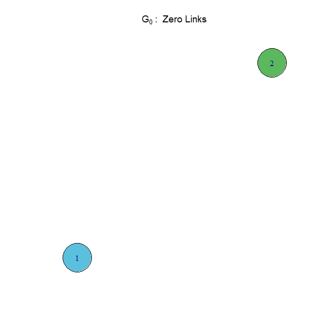
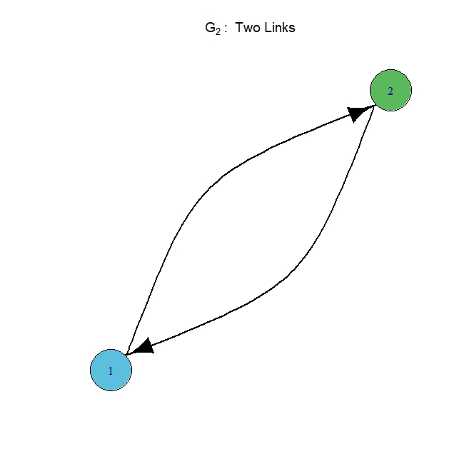
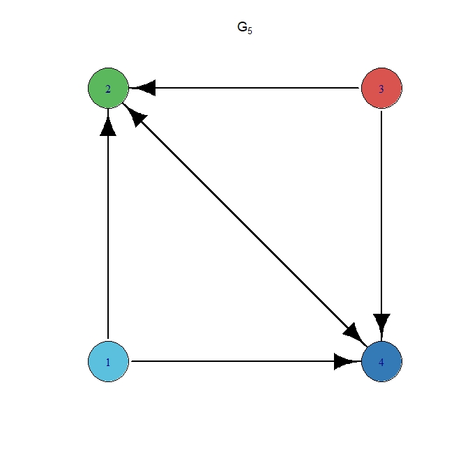
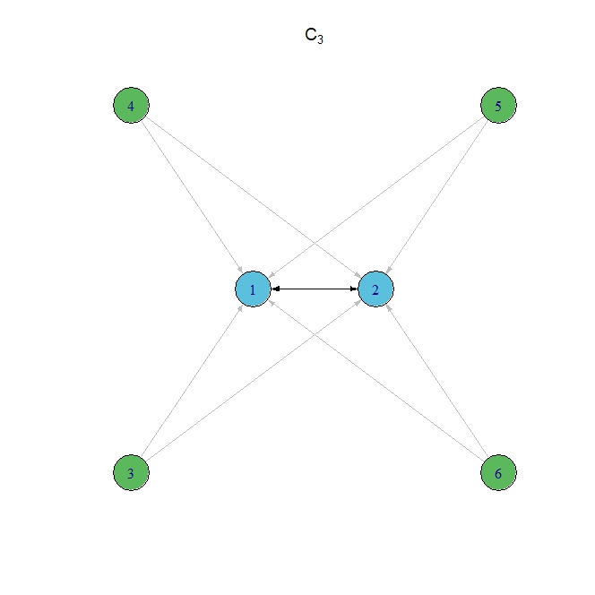
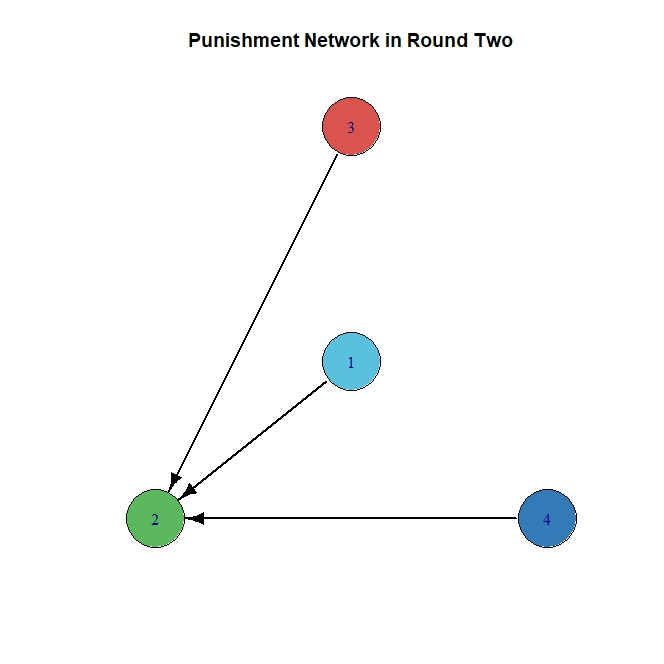

---
title: Problem Set myps
output: 
  html_document: 
    keep_md: yes
    toc: yes
---


## Exercise Introduction

<head>
<style>
.TheoremBox {
  background-color: #58D68D;
  width: 1000px;
  border: 7px solid #1E8449;
  border-radius: 15px;
  padding: 30px;
  margin: 20px;
}
.LemmaBox {
  background-color: #F2D7D5;
  width: 1000px;
  border: 7px solid LightCoral;
  border-radius: 15px;
  padding: 30px;
  margin: 20px;
}
.DefinitionBox {
  background-color: #AED6F1;
  width: 1000px;
  border: 7px solid #3498DB;
  border-radius: 15px;
  padding: 30px;
  margin: 20px;
}
</style>
</head>

<div class="TheoremBox">
asdasdsaasssss
</div>
<div class="LemmaBox">
asdasdsaasssss
</div>
<div class="DefinitionBox">
asdasdsaasssss
</div>


```r
SFmap <- leaflet() %>% 
  addTiles() %>% 
  setView(9.9620289,48.4251394, zoom = 11) %>% 
  addMarkers(9.963614702355699,48.42517242865929,
    popup = 'RTutor was created here at Ulm University')
```

```
## Error in addMarkers(., 9.9636147023557, 48.4251724286593, popup = "RTutor was created here at Ulm University"): konnte Funktion "addMarkers" nicht finden
```

```r
SFmap
```

```
## Error in eval(expr, envir, enclos): Objekt 'SFmap' nicht gefunden
```


This is an R Markdown document. Markdown is a simple formatting syntax for authoring HTML, PDF, and MS Word documents. For more details on using R Markdown see <http://rmarkdown.rstudio.com>.

`assdasad`

When you click the **Knit** button a document will be generated that includes both content as well as the output of any embedded R code chunks within the document. You can embed an R code chunk like this:


```r
shinyAppDir(
  "MyApp",
  options = list(
    width = "100%", height = 1100
  )
)
```

```{=html}
<div style="width: 100% ; height: 1100px ; text-align: center; box-sizing: border-box; -moz-box-sizing: border-box; -webkit-box-sizing: border-box;" class="muted well">Shiny applications not supported in static R Markdown documents</div>
```


## Exercise 1. The Game

# A First Example

Gutes Bsp finden

# Mathematical Model of the Game

Now, let's look at a mathematical model of the game. First of all, there are $n$ players. Every player $i \in N := \{1,..,n\}$ simultaneously has to decide about an investment size $x_i \in \mathbb{N}_0$ and a vector of links $g_i \in \{0,1\}^n$. At that, every entry $g_{ij}$ is $1$ if player $i$ forms a link to player $j$, and  otherwise is $0$. Therefore, the tuple $s_i = (x_i,g_i)$ denotes a strategy for player $i$. The vector $g = (g_1,...,g_n)$, which consists of the linking decisions of all $n$ players, defines a directed network architecture. Together with the vector of investment decisions $x = (x_1,...,x_n)$ of all players, $s = (x,g)$ defines a strategy profile. Let $S$ denote the set of all possible strategy profiles. <br>
By linking to player $j$, player $i$ profits from $j$'s investment. Define $N_i(g) := \{j\in N: g_{ij} = 1\}$ as the set of players that $i$ links to with $\eta_i(g) := |N_i(g)|$ as out degree of $i$. Analogous, define the in degree of $i$ as $\omega_i(g) = |\{j\in N: g_{ji} = 1 \}|$. The total investment that $i$ accesses is now denoted as $y_i = x_i + \sum_{j \in N_i(g)}x_j$. In our model, player $i$ values it's own investment the same way as the investments from other players which he is linked to. <br>
The overall investment gets evaluated by a concave and increasing function $f$ with $f(0) = 0$, so that the benefits of player $i$ are $f(y_i)$. <br>
Every investment comes with a constant cost of $c > 0$ per unit and linking costs denoted by a constant of $k>0$ per link. In contrast, players get a reward of $b \geq 0$ per incoming link, called status rent. To ensure that there won't arise cycles where players profit from each other only by linking without any investments, we have to set $k > b$. <br> 
Overall we get the payoff of player $i$ by the following function: 
$$\pi_i(s) = f(y_i)-cx_i-k\eta_i(g)+b\omega_i(g)$$
 
To get a familiar with these definitions, here are some exercises to practice. 
In the following code chunk I created a dummy network $g$. Please run the hole chunk by pressing `check` to set up and plot $g$.

<!-- --><!-- -->

Let's choose this network as basis for the further calculations. Also, assume that the parameters are as the following: <br>
Cost of linking $k = 70$, cost of investing $c = 55$ and status rent $b = 22$. These paremeters also are used in the experiment as we will discover later.


Quiz: How does the linking vector $g_2$ based on the network $g$ look like?

- \((1,1,0,0)\) [ ]

- \((1,0,1,1)\) [ ]

- \((1,0,0,0)\) [x]


Quiz: What is the value of $\omega_3(g)$?

- \(0\) [x]

- \(1\) [ ]

- \(2\) [ ]

- \(3\) [ ]


Quiz: What is the value of $\eta_2(g)$?

- \(0\) [ ]

- \(1\) [x]

- \(2\) [ ]

- \(3\) [ ]


Now, for simplicity just assume that $f(1) = 92$ and $f(2) = 152$.


Quiz: What is the value of $\pi_2$, if every player invests in one unit, i.e. $x_1=x_2=x_3=x_4=1$?

- \(32\) [ ]

- \(148\) [ ]

- \(93\) [x]

- \(163\) [ ]


***

### Award: Game Model Expert
Nice! You understand the theoretical model behind the game.

***


## Exercise 1.1 The Experiment

To approach the experiment, it is useful to examine the underlying data set. The first step is to load the data set `rawdata.csv`, save it in the variable `dat` using the command `read.csv()` and print the first six lines using the command `head()`.


```r
dat = read.csv('rawdata.csv')
head(dat)
```

```
##   X ppnr session  sexe totverdeuros groep inzet round la lb lc ld le lf lg lh
## 1 1  101      16 vrouw         13.7     1    10    15  0  1  0  0  0  0  0  0
## 2 2  102      16   man         60.4     1   600    40  0  0  0  0  0  0  0  0
## 3 3  103      16 vrouw         23.7     1   200    68  0  0  0  0  1  0  0  0
## 4 4  104      16   man         25.6     1   300    24  0  0  0  0  0  1  0  0
## 5 5  105      16 vrouw         82.3     1   300    59  0  0  0  0  0  0  0  0
## 6 6  106      16 vrouw         23.9     1   300    16  0  1  0  0  0  0  0  0
##   info verdiensten role n  b exolinks
## 1    2          16    a 8 66        1
## 2    2         306    b 8 66        1
## 3    0          82    c 8 66        1
## 4    2          16    d 8 66        1
## 5    2         504    e 8 66        1
## 6    1          52    f 8 66        1
```
<br>

As we can see, every row seems to provide some characteristics about a player and his decisions in a specific part of the experiment. Let's investigate this further. The columns `n` and `b` obviously give us information about the number of players participating and the status rent in the current game. To find out about the different values of a column, you can use the command `unique()` on a column. To access a specific column, you can use the `$` command as follows: `DatasetName$ColumnName`. Now use to `unique` command on the columns `n` and `b`.


```r
unique(dat$n)
```

```
## [1] 8 4
```

```r
unique(dat$b)
```

```
## [1] 66 22  0
```
<br>


Quiz: Now look at the outcoming values. Mark all the settings which occur in a game in the experiment at least once.

- \(b = 0\) [x]

- \(b = 4\) [ ]

- \(n = 8\) [x]

- \(b = 22\) [x]

- \(n = 22\) [ ]


<br>
<br>
Great, let's move on to the other columns. Every game in the experiment gets finitely often repeated and the column `round` gives the current round in which the players are. To find out about different settings in rounds it is not enough to do the same trick again, since we would detect every round and can never be sure if there might be a setting with a smaller number of maximal rounds than the maximal detected round. A very handy tool for this problem is a table. For this, use the command `table()` with the column `round` as input.


```r
table(dat$round)
```

```
## 
##   1   2   3   4   5   6   7   8   9  10  11  12  13  14  15  16  17  18  19  20 
## 320 320 320 320 320 320 320 320 320 320 320 320 320 320 320 320 320 320 320 320 
##  21  22  23  24  25  26  27  28  29  30  31  32  33  34  35  36  37  38  39  40 
## 320 320 320 320 320 320 320 320 320 320 320 320 320 320 320 320 320 320 320 320 
##  41  42  43  44  45  46  47  48  49  50  51  52  53  54  55  56  57  58  59  60 
## 320 320 320 320 320 320 320 320 320 320 320 320 320 320 320 320 320 320 320 320 
##  61  62  63  64  65  66  67  68  69  70  71  72  73  74  75 
## 320 320 320 320 320 320 320 320 320 320 320 320 320 320 320
```
As we can see, every round occurs exactly 320 times, which implies that the only setting which was played in the experiment was a 75 rounds repeated game.
<br>
As next column, consider `info`. This one gives us the information, in how much units the related player invests in the current situation. Now again, use the command `table` on this column. 


```r
table(dat$info)
```

```
## 
##     0     1     2     3     4     5     6     7     8     9    10 
## 13995  2169  5506   904   637   269   109   165   147    41    58
```
That is quite interesting. Seemingly most of the investment descisions are just to not invest, and the higher the investment, the less likely is it. 
<br>
In order to investigate the underlying networks, we first have to look at the organisation of the experiment. The columns `groep`, `session` and `role` provide us with the information. 
<br>
*describe exp. organisation*
<br>
<br>
Now it is time to look at the networks hat have arisen in the experiment. For this purpose i created the following shiny application, where you can plug in a session, a group and a round to get the plot of the related network and the current investment levels as well as the status rent $b$ and the information if the linknig decisions were exogenous or endogenous. 

## Exercise 2.1 Theory: Analysis of the One Shot Game

After introducing the theoretical model, our main goal is to predict the outcome of the experiment, at best in relation to an underlying theory. For this reason we start analysing the one shot game, in order to identify optimal ways of playing the game.

# Nash Equilibrium

First, we consider the concept of a Nash Equlibrium. Simply spoken, a (strict) Nash Equilibrium is reached, whenever every player plays a strategy and is not able to improve his own payoff (weakly) by deviating from his own strategy, if all the other players do not change their strategies. Let's fomalize this properly:


<div class="DefinitionBox">
<b>Definition ???: </b> <br>
A strategy profile \(s = \{s_1^*,\dots,s_n^*\}\), where \(s_{i}^*\) denotes player \(i\)'s strategy, is called a <b>Nash Equlibrium</b> (NE), if for all players \(i \in N\) the following holds:
\[\pi_i (s_i^*,s_{-i}^*) \ge \pi_i (s_i,s_{-i}^*) \ \forall s_i \in S_i\]
Additionally, \(s\) is called a <b>strict Nash Equlibirum</b> (strict NE), if for all players \(i \in N\) the following holds: 
\[\pi_i (s_i^*,s_{-i}^*) > \pi_i (s_i,s_{-i}^*) \ \forall s_i \in S_i \setminus \{s_i^*\}\]
</div>

<br>
EXAMPLE NE 
<br>

# Total Equilibrium Investment 

To identify Nash Equilibria in the one shot game, we first consider a simplified version of the game, where there is only $n = 1$ player. Clearly, he has no possibility to link to other players, so only investing is possible. Since the evaluating function $f$ is concave, the profit of investing in new units gets smaller with higher investments. Therefore, there has to be an optimal number of units in which player $1$ should invest. This leads to the next definition:
<div class="DefinitionBox">
<b>Definition ???:</b> <br>
Let \(f\) be a concave evaluating function with \(f(0)=0\) and \(c>0\) the cost of investing per unit. Then the value 
\[\hat y = \underset{{x\in \mathbb{N}}}{\text{argmax}}\{f(x)-cx\}\]
is called <b>total Equilibrium Investment</b>.
</div>
In [1], van Leeuwen et al. call $\hat y$ the "optimal public good investment if
players were to act in isolation". This definition fits perfectly to the simplified version with $n=1$ players. However, as we will discover later, the value $\hat y$ will play an important dual role as it also denotes the total number of units invested in a strict Nash Equilibrium. <br>

In order to make the concept of $\hat y$ clearer, the next exercise will give you a concrete example from the experiment.
<br> 
<br>

The values of the function $f$ which is used in the experiment are stored in the file `f.csv`. Load the dataset via the command `read.csv()` and store it in the variable `f`. After that, print out the first 5 lines with the command `head()`.

```r
f = read.csv('f.csv')
head(f,5)
```

```
##   x f_x
## 1 0   0
## 2 1  92
## 3 2 152
## 4 3 177
## 5 4 196
```


Quiz: Now look at the five entries. If we again assume $c = 55$ as in the experiment, is it already possible to deduct the value of $\hat y$? If so, what is the value of it?

- No. [ ]

- Yes, it is \(1\). [ ]

- Yes, it is \(2\). [x]

<br>

Let's check this answer in a graphical way by looking a the following plot, where the functions $f(x)$ and $f(x) - 55x$ are visualised:

<br>


<br>

Indeed, by looking at the maximum of the lower function, the correct value is $\hat y = 2$, so in the NE, player $1$ would invest in two units.
<br>
<br>
Now we want to investigate the generall $n\in \mathbb{N}$ case. Let's imagine some network $G$ and some investments by the players. In a NE, there can not exist a player who accesses less than $\hat y$ units, since otherwise he would be able to improve his payoff by investing in one more unit. Important to notice is, that it is not relevant if the units come from a link or by self investing. This leads to the following rule:
<br>
<b>Rule $1$: In a NE, player $i$ has to access as least $\hat y$ units.</b>
<br>
On the other hand, let us assume player $i$ accesses more than $\hat y$ units in a NE. If he just accesses them by linking other players, a general claim about the optimality of his decision is difficult to make. But if he is also investing in units by himself, i.e. $x_i > 0$, he can improve his payoff by lowering his investment by $\text{min}\{x_i,|\hat y-y_i| \}$, due to the nature of $\hat y$. This leads to the next rule:
<br>
<b>Rule $2$: In a NE, if player $i$'s investment is positive, i.e. $x_i>0$, he has to access at most $\hat y$ units. </b>
<br>
The both rules now get summarized by the following Lemma:
<br>
<br>

<div class="LemmaBox">
<b>Lemma ?: </b><br>
In a strict Nash Equilibrium, every player \(i\) accesses at least \(\hat y\) units. If player \(i\) additionaly invests in a posiitive number of units by himself, i.e. \(x_i>0\), then he has to access exactly \(y_i = \hat y\) units.
</div>


# Nash Equilibria in Networks with few Players

To get some more intuition about Nash Equilibria in networks, let us investigate the case with $n = 2$ players. Since the linking possibilities are quite limited, the following three network architectures are the only possible ones to arise, if we treat $G_1$ the same way as its symmetrical mirrored network. 
<br>



<br>

We want to find out about the NE in every of single one of the cases. For that, we first assume that the given network architecture is fixed to get the optimal investment levels. After that, we check if a player wants to deviate by changing his linking decision, possibly with his investment decision. 
<br>
$G_0$<b> with zero links:</b> <br>This case is quite easy, since in a fixed network both players act like in the $n = 1$ case by simply investing in $\hat y$ units, which leads to a payoff of $\pi_1^{G_0}= \pi_2^{G_0} = f(\hat y) - \hat yc$. 
<br>
$G_1$<b> with one link:</b> <br>In this case, player $2$ has no outgoing link, which means he only accesses his own investment units. Therefore, his optimal strategy is to invest in $\hat y$ units for a payoff of $\pi_2^{G_1} = f(\hat y) -\hat y c + b$. Player $1$ accesses now $\hat y$ units by linking to player $2$ and thus does not invest by himself in order to play the optimal strategy, see rule $2$. He gets a payoff of $\pi^{G_1}_1 = f(\hat y) -k$.
<br>
$G_2$<b> with two links:</b> <br> In the third case with the two links, both players access the others investment. Therefore, if the sum of both investments equals the optimal public good investment $\hat y$, i.e. $x_1+x_2=\hat y$, by the rules $1$ and $2$ from above, no player would invest more or less that his current investment. Therefore, the payoff of player $i$ is $\pi^{G_2}_i=f(\hat y)-x_ic-k+b$.
<br>
<br>
Now it is up to check if and when the players want to deviate from their networks. In the network $G_0$, both players can only deviate to the role of player $1$ in the network $G_1$, so to prevent deviation, $\pi^{G_0}_1 > \pi^{G_1}_1$ has to hold. This formula simplifies to the condition $k>\hat y c$, which would mean that linking in general worsens the payoff. 
<br>
Now consider the network $G_1$. Player $2$ has no motivation to deviate from the current network structure, since then he would have to link to player $1$ whos investment is $0$, and therefore player $2$'s payoff would just drop by the linking cost $k$. On the other hand, player $1$ will deviate to the $G_0$ network by canceling his link and investing in $\hat y$ units if the condition $\hat y c > k$ fails, which is the reversed one from the last case. 
<br>
In the network $G_2$, player $i$ possibly can deviate to player $2$ in the $G_1$ network by canceling his link and investing in $\hat y$ units. In order to prevent deviating, the cost for self investing should be higher than the cost for the current link, so the relation $\pi^{G_2}_i > \pi^{G_1}_2$ appears, which simplifies to $x_{-i}c > k$. Since in a NE, both players should not deviate, so the condition $\text{min}\{x_1c,x_2c\} > k$ has to hold.
<br>
<br>


Quiz: Assuming $n = 2$ players and the parameters from the experiment $c = 55$ and $k = 70$, for which network architecture is a Nash Equlibrium possible?

- \(G_0\) [ ]

- \(G_1\). [x]

- \(G_2\). [ ]


<br>
<br>

To summarize this chapter, let us observe the following: The higher the investing costs $c$ are in relation to the linking costs $k$, the less links appear in a Nash Equlilibrium network, which might be kind of natural. When investing in $\hat y$ is less expensive than linking to a player, $G_0$ forms a network with a NE. If it is the other way around, there is a NE in the $G_1$ network, and if additionally the fraction $\frac{k}{c}$ is even more complaisant by being small enough, the network $G_2$ also has a NE. 
<br>
Also important to note is that the status rent $b$ does not play any role in deciding about a NE, which is reasonable, since no player has any ability to decide if another player links to him to gain him the status rent. 
<br>
In the further course we want to disregard the case $k>\hat y c$, since this always leads to an empty network in the NE, which is trivial. 
<br> <br>
Since the two players examples are quite primitive, let's have a look at some examples of the $n = 4$ case, to get an idea of which structures are necessary to provide a NE. 
<br>
Now first of all, consider the following network:
<br>

<br>
Assume, this network appears in a NE. Since player $4$ has no outgoing link, he invests in $x_4=\hat y$ units to be optimal. Now player $2$ already accesses $\hat y$ units trough his link, and therefore invests in $x_2=0$ units himself, by LEMMA. This leads to a contradiction, since player $1$ links to player $2$, but this link only costs him $k$ and gains him no additional units. So it would not be rational to do that, and therefore no NE is possible in this network. Somehow, the path from player $1$ to player $4$ over player $2$ seems to generate a problem here. The same holds for the path between player $3$ and player $4$ over player $2$, since it is the symmetric case. On the other hand, maybe the link from  player $2$ to player $4$ is a problem. 
<br>
Therefore, let's first investigate the network, where the two incoming links from player $2$ are deleted:
<br>

<br>
This network is a star network. Player $4$ again invests in $\hat y$ units, since he has no outgoing links. The other players already access $\hat y$ units through their links, so by LEMMA they invest in $x_1=x_2=x_3 = 0$ units. In this case, the non-investing players have no will to deviate into cancelling their link and investing $\hat y$ by themselfes as long as $\hat yc > k$, and player $4$ has not even a possibility to deviate in a sensefull way, since he already invests the optimal amount of units and linking to non-investing players is not reasonable. Therefore, with the condition $\hat y c>k$, it is possible to form a NE in this network. 
<br>
The next network provides an example, where the link from player $2$ to player $4$ from the $G_3$ network got deleted:
<br>

<br>
To get a NE in this network, player $2$ and $4$ have to invest in $x_2=x_4 =\hat y$ units, since they have no outgoing link. Also, since player $2$ chooses not to deviate by linking to player $4$ and investing in $x_2=0$ units, it has to hold that $k\geq \hat yc$. On the other hand, since player $1$ chooses not to deviate by investing in $\hat y$ units and cancel one link, $k \le \hat yc$ has to hold and this induces the equation $k = \hat yc$. Now since player $1$ also does not deviate by just cancelling one link to access $\hat y$ units instead of $2\hat y$ units, the equation $k \le f(2\hat y)-f(\hat y)$ appears, which can be rewrited as $f(\hat y)-2\hat yc + k \leq f(2\hat y)-2\hat yc$ which with the above equation simplyfies to $f(\hat y)-\hat yc \leq f(2\hat y)-2\hat yc$ and this leads to a contradiction due to the definition of $\hat y$.
<br>
Since the $G_3$ network without the link from player $2$ to player $4$ provides no NE, let us consider the $G_3$ network with an additional link from player $4$ to player $2$.
<br>

<br>
The sub network with only player $2$ and player $4$ can be treated the same way as the network $G_2$ from the $n=2$ example, since the only difference for them is one additional status rent $b$. Therefore, the units in which the players $2$ and $4$ invest have to sum up to $\hat y$, i.e. $x_2+x_4=\hat y$. This leads to the fact, that player $1$ and player $3$ access $\hat y$ units, which means that they both invest in zero units, i.e. $x_1 = x_3 = 0$, by the LEMMA. Now we have to check, under which conditions nobody wants to deviate. Without loss of generality, let $x_2 \le x_4$. Now the question for the players $1$, $3$ and $4$ is, if their link to player $2$ is worth the cost $k$, since otherwise they can invest in $x_2$ units by themselfes. Therefore, it has to hold that $k < x_2c$ and in general that $k< \text{min}\{x_2c,x_4c\}$, which is the same condition as in the $n=2$ case.
<br>
As a last network, consider the following cycle: 
<br>

<br>
In this one, every player $i$ has an incoming link and therefore has to have a positive investment $x_i > 0$. Therefore, $y_i = \hat y$ has to hold for every player $i$ by LEMMA. Additionaly, $x_1=x_2=x_3=x_4$ has to hold, since otherwise the player who links to the player with the lowest investment would deviate by cancelling his link and linking to the player (excluding himself) with the highest investment. This means that $x_i = \frac{\hat y}{2}$ has to hold for every player $i$. But this implies, that player $1$ would get the same payoff in the current setting as if he would cancel his link and links to player $3$, which contradicts a strict NE.

<br>
<br>
Let us summarize this. The two networks $G_4$ and $G_6$ with a NE have the common ground that there exists a set of players, in $G_4$ only player $4$ and in $G_6$ the players $2$ and $4$, who provide the units to all other players and themselfes. This is a hint for the general case and gets proven in the next capter. In $G_3$, the links to player $2$ are unneccessary and prevent a optimal distribution, in $G_5$ the links between player $2$ and $4$ are missing, so they do not benefit from each other, which is also not optimal. The network $G_7$ shows, that this kind of cycles can occur in a NE, but not in a strict NE. Also it is noticeable, that in the strict NE networks the overall sum of units in which got invested is always just $\hat y$ which gives us also a hint for the general case. With this ideas in mind, let us jump to the next section.


Quiz: Now look at the following networks from the experiment. Which of them can possibly have a NE?

- \(1\) [x]

- \(2\) [ ]

- \(3\) [ ]


# Core-Periphery Network

The examples from last section suggest, that in a strict NE there is a small group of players which supply all players with units. We now want to investigate this further, and therefore define this idea properly.

<div class="DefinitionBox">
<b>Definition ??:</b><br>
A network \(G\) is called <b>core-periphery network</b>, if the set of players \(N\) is divided in two sets \(N_C(G)\) and \(N_P(G)\), where every player \(i\in N\) exclusively forms a link to every other player in the core set \(N_C(G)\setminus\{i\}\).
</div>

This definition leads directly to the following theorem:

<div class="TheoremBox">
<b>Theorem ???:</b><br>
In every strict NE, a core-periphery network forms with the set \(N_C\) as core and \(N_P\) as periphery. The overall sum of units in which the players invest is exactly \(\hat y\), i.e. \(\sum_{i\in N}x_i^N = \hat y\). The size of the core is bounded by \(|N_C| < \hat y \frac{c}{k}\).
</div>

I proved this in a little bit more detail in the following section. You can unfold it by pressing the "Proof ????" Button.


The goal is to prove, that in every strict NE a core-periphery network is formed. <br>
To prove this, it is easier to prove another result first, namely $\sum_{i\in N}x_i^N = \hat y$. This means, that the overall sum of the investment units is exactly $\hat y$.
First of all, the sum can not be smaller than $\hat y$, because after the LEMMA every player accesses at least $\hat y$ units. 
Now we divide the players into the set $N_0$, which consists of all players with no incoming links, and the set $N_1$ which consists of all players with incoming links.
It follows directly, that the sum of the investments of all players with incoming links also at least has to be $\hat y$, i.e. $\sum_{i\in N_1}x_i^N \ge \hat y$. Since we want to prove equality here, let's assume $\sum_{i\in N_1}x_i^N > \hat y$ for a contradiction proof.
<br>

Before starting with the argument, we have to note two easy properties. First of all, by the nature of the sets $N_0$ and $N_1$, $x_i^N > x_j^N$ has to hold $\forall i \in N_1, j \in N_0$, since otherwise a player who links to $i$ can link to $j$ instead and improves. Secondly, $cx_i^N>k$ has to hold $\forall i \in N_1$, which means that the cost of linking to a player from $N_1$ has to be lower than the cost of selfinvesting in the same number of units which get accessed by linking. Otheriwse, the players from $N_0$ can just improve by canceling their links and invest in the missing units by themselfes. Also it follows that $x_i >0$, since $k > 0$ has to hold. <br>
<br>
Now after LEMMA it is clear, that every player in $N_1$ accesses exactly $\hat y$ units. But since we assume that the sum of all units from $N_1$ is greater than $\hat y$, for every player $i\in N_1$ there has to exist a player $j\in N_1$ to which $i$ is not linked to, i.e. $g_{ij} = 0$. If the $N_1$ players now get ordered by their investments, w.l.o.g. the ordering $x_1^N \geq \ldots \geq x_m^N > \frac{k}{c}$ appears.
<br>
Now, consider the player $m$. Every player from $N_1$ who links to $m$ can (weakly) improve by linking to another player instead of $m$. This contadicts a strict NE. Therefore, $m$ gets no incoming links from $N_1$. <br> To visualise this better, let's look at a concrete example with the following network $C_1$. 
<br>

<br>
Here, the blue players refer to the $N_1$ players. For a NE, they all have to invest in $\frac{\hat y}{2}$ units, see network $G_7$ from above. Therefore we are in our case in which $\sum_{i\in N_1}x_i = \frac{3}{2}\hat y > \hat y$ holds. If we now choose player $3$ as player $m$, player $2$ is indifferent in linking to $3$ or $1$, so the current setting can not be a strict NE. Let's continue with the general proof. <br> <br>


Since every player from $N_1$ accesses exactly $\hat y$ units, there has to be a smallest subset $N_1^*\subset N_1\setminus \{m\}$, such that the number of invested units add up to $\hat y$, namely $\sum_{i \in N^*}x^N_i = \hat y$. But now, since $x_ic > k \ \forall i \in N_1$, $m$ can strictly improve by cancelling his investment and linking to all players from $N_1^*$. This contradicts $m$ beeing in $N_1$ in a NE, which contradicts the assumption $\sum_{i\in N_1}x_i^N > \hat y$. Again, let's consider a concrete example with the network $C_2$ to clarify the argument. <br>

<br>
We treat player $3$ still as our player $m$. Assume now, that player $1$ invests in $x_1 > x_2 = x_3>0$ units, while $x_1+x_2 = \hat y$. This is neccessary to guarantee that every blue player accesses exactly $\hat y$ units and neither of the blue players is indifferent of linking to another player versus the current situation, to not get a contradiction this way. Now we choose the smallest subset $N_1^* = \{1,2\}$. Player $3$ already links to player $1$, but not to player $2$. Since the link from player $4$ to player $2$ is cheaper for player $4$ than investing $x_2$ by himself (by the assumption $k<x_ic$ from above), the same holds for player $3$. Therefore he can improve by setting his own investment to $0$ and linking to player $2$. This contradicts a NE in the network $C_2$. If we follow the path and let player $3$ deviate as described, the green $N_0$ players should cancel their links to player $3$ which results in the core-periphery network $C_3$ with a overall sum if investments of $\hat y$.
<br>

<br>
<br>
We just found out, that in a NE, $\sum_{i\in N_1}x_i^N = \hat y$ has to hold. Since $x_ic >k \ \forall i \in N_1$, no player from $N_0$ invests by himself since he can link to the whole $N_1$ set instead with lower costs while he still accesses $\hat y$ units. Therefore, the overall sum of units in which the players invest has to be $\hat y$, i.e. $\sum_{i\in N}x_i^N = \hat y$. Additionally, the network forms a core-periphery network with the core $N_C = N_1$ and the periphery $N_P = N_0$.
<br> 
For the last result, we just have to look at the achieved formulas: $\hat y = \sum_{i\in N_C} x_i^N > \sum_{i\in N_C} \frac{k}{c} = |N_C|\frac{k}{c} \Leftrightarrow |N_C| < \hat y \frac{c}{k}$. This provides an upper bound for the size of the core.


Note that the entire proof is independend of the status rent $b$ and the total number of players $n$. The first observation regarding status rent $b$ is evident because no player has any chance of deciding if other players link to them. However, the second observation regarding $n$ is more interesting. In a Nash Equilibrium setting with ten players instead of a thousand, the core size would remain the same. This may seem counterintuitive, but it is true.


Quiz: Let's go back to what we wanted to experiment with. Let's assume that $k=70$, $c=55$, as in the experiment, and $\hat y$ to be the same as in the previous exercise. What's an allowable player count in the core for a strict Nash Equilibrium?

- \(1\) [x]

- \(2\) [ ]

- \(3\) [ ]


# Efficient Outcome

Another way of measuring the optimal way to play is to maximise the payoff for the whole group, rather than maximising the payoff for each individual. A proper definition is the following:

<div class="DefinitionBox">
<b>Definition ??:</b><br>
Let \(s=\{s_1,\dots,s_n\}\) be a strategy profile, where \(s_i\) denotes the strategy of player \(i\). The <b>social welfare</b> of \(s\) is defined by 
\[W(s) := \sum_{i\in N}\pi_i(s)\]
Furthermore, \(s\) is called <b>efficient</b>, if it maximizes the social welfare, i.e.:
\[W(s) \geq W(s') \ \forall s' \in S\]
</div>

To approach an efficient outcome, we consider a fixed total investment of $y$ units. The goal is now to minimize overall costs and maximize the overall payoff, i.e. making sure that as many players as possible have access to as many units as possible. The current welfare is given by

$$W(s) = \sum_{i\in N}f(y^N_i) - c\sum_{i \in N}x^N_i - k\ \big\vert \{g_{ij}=1 \ | \ i,j \in N \} \big\vert$$

It turns out, that a star network is the most efficient network architecture, since every players accesses the full $y$ units, so the first term gets maximized. In the same time, the second term gets minimized to $yc$, which is the lowest cost neccessary to distribute $y$ units. With the assumption $k < yc$, which is neccessary to guarantee that linking to the core player is more valuable than selfinvesting, the last term is also optimized to $k(n-1)$, since $n-1$ is the smallest number of links which are neccessary, that every player accesses the $y$ units. <br> 
So now consider a fixed star network architecture to approach the optimal number of units $\widetilde{y}$, in which the core player should invest. It is already clear, that $\widetilde{y} > \frac{k}{c}$ has to hold. At every investment level $y$ it is always worth it to increase the investment by one, as long as the additional costs of the core player do not exceed the extra gain of all $n$ players by the new unit. Thus, $\widetilde{y}$ is the greatest $y$ with $n(f(y)-f(y-1)) \geq c$. A star network with $\widetilde{y}>\hat y$ is called superstar. Note that, again, this result is independend of the status rent $b$.
<br>
<br>
Consider the following star network with player $1$ in the core and three players in the periphery. Assuming $k = 70$ and $c=55$ as in the experiment and $f$ as above.
<br>


Quiz: What is the value $\widetilde{y}$ of the optimal number of units in which player $1$ should invest in order to maximize the social welfare?

- \(3\) [ ]

- \(4\) [x]

- \(5\) [ ]

As you can see, in our case it holds that $\widetilde{y}>\hat y = 2$. This means, that in order to maximize the social welfare of the group, the core player $1$ has to invest in more units than he needs for his personal optimal payoff.
<br>


Quiz: What payoff $\pi_1^N$ would player $1$ receive if he invests in $\widetilde{y}$ units, assuming we have a status rent of $b = 22$?

- \(42\) [x]

- \(64\) [ ]


Quiz: What payoff $\pi_1^N$ would player $1$ receive if he invests in $\hat y$ units, assuming we have a status rent of $b = 22$?

- \(108\) [x]

- \(130\) [ ]

As you can see, it is way more rentable for player $1$ to invest in $\hat y$ than in $\widetilde{y}$ units, although the whole group would profit more from the $\widetilde{y}$ investment.
<br>


Quiz: What payoff would the periphery players $2$, $3$ and $4$ receive if player $1$ invests in $\widetilde{y}$ units?

- \(107\) [ ]

- \(126\) [x]


Quiz: What payoff would the periphery players $2$, $3$ and $4$ receive if player $1$ invests in $\hat y$ units?

- \(82\) [x]

- \(97\) [ ]


As we can see, it is in the interest of the periphery that the core invests in as many units as possible, because they profit directly from the additional units and have no additional costs. In a one shot game, the core would never invest in more than $\hat y$ units, as his payoff would decrease otherwise. But as the game in the experiment got 75-times repeated, the periphery is possibly able to force the core to invest in more units than he likes. Therefore, let's investigate the finitely repeated version of the game. 


## Exercise 2.2 A Note on Subgame Perfect Nash Equlibria

REFERENZ SPNE einbauen

In the last chapter we learned, that in all strict NE of the one shot game a core-periphery network forms, where the core invests in $\hat y$ units. We discovered also, that while the investment level $\hat y$ is necessary for a strict NE, it is not the same as the socially optimal investment level $\widetilde{y}$. Since in the experiment the game is played in a 75 round repeated version, there might be a subgame perfect NE (more about SPNE in [2]), where the players can improve their total payoff by playing the social optimum in some rounds. <br>
In general, the number of subgame perfect NE is often very large. One exepction is, if the one shot game only has one NE. Then, the only SPNE is to repeat the NE in every round, which can easily shown by backwards induction. If there exist more than one NE in the one shot game, it opens up possibilities for SPNE where in the first couple of rounds no NE is played. This works because players can force each other to play slightly suboptimal (in the sense of a NE) strategies at the beginning due to punishment possibilites in the end in case of deviation, if the payoffs of the different NE's differ. 

<br>
As van Leeuwen et al. show in [1], there exists a SPNE, where for a specific $t < 75$, in the first $t$ rounds every player is alternatly in the core with an investment of $\widetilde{y}$, where the other players form the periphery. But since in our experiment the players have no possibility to communicate properly, it is very unlikely that the players can coordinate such a strategy. They also prove that there exist SPNE where a fixed player is in the core in every round, while the other players remain in the periphery. Since the concept of a SPNE will not be central for the predictions of the outcome of the experiment, I will not go into detail here further. I only will provide a concrete exmaple to point out the main dynamic in SPNE's between the core and the periphery.    


<br>
To give some inutuition about how such a SPNE can look like, I provide the following example. Consider the following star network with the parameters as in the experiment. We play a two round game, where the one shot game is simply repeated twice. 

<br>

<br>

Consider the following strategy: <br>
- Player $1$ invests in $\widetilde{y} = 4$ units in round one and in $\hat y = 2$ units in round two. <br>
- The periphery players just link to him in both rounds and invest nothing. <br>
- If player $1$ deviates in the first round, player $2$ invests in $\hat y$ units in round two and player $3$ and $4$ link to him, while they still invest in zero units. <br>
- If one of the periphery players deviates in round one, the strategy for round two remains the same for the other players. <br> 
<br>

<br>

Now let's check if this is a SPNE. Note that the strategy in round two is a NE, and therefore no player will deviate in round two. Also, no periphery player will deviate in the first round, since he has no possibility to achieve a higher payoff through his deviation. So, let's have a look at the core player. The payoff of player \(1\) in round one is \(\pi_1^1 = 3b-24\) and in round two is \(\pi_1^1 = 3b+42\), which sums up to a total payoff of $\pi_1^{strat} = 6b+18$. If he deviates in round one, he will invest in $\hat y = 2$ units, which leads to a payoff of $\pi_1^{1} = 3b+42$ in round one. In round two he will link then to player $2$ and get a payoff of $\pi_1^2 = 82$, which sums up to a total payoff of $\pi_1^{dev} = 3b+124$. For a NE, $\pi_1^{dev} \le \pi_1^{strat}$ has to hold which simplifies to ${b \ge 35.}  \overset{\_}{3}$. This means, that if the status rent $b$ is large enough, the periphery can force the core to invest in more units than in a one shot NE, because they can threat to cancel their links. 
<br>
To get subgame perfect NE, we have to check if the punishment of the periphery, i.e. the third point in the strategies, is realistic. If player $1$ deviates in the first round, the payoff of the players $3$ and $4$ stay the same in round two than it would be if all players would stick to the original strategy. But for player $2$, his payoff changes. Would they play the NE with player $1$ in the core as if he would not have deviated in round one, player $2$'s payoff in round two is $\pi_2^{no \ punish} = 82$. If they punish player $1$ instead, player $2$'s payoff in round two is $\pi_2^{punish} = 42+3b$. So therefore, player $2$ is only willing to perform the punishment, if $\pi_2^{no \ punish} \le \pi_2^{punish}$ which simplifies to $b \ge 13.\overset{\_}{3}$. As we can see, with low status rents it might happen that the periphery has not even the possibility to punish the core for deviating from a strategy, and therefore high status rents are necessary to maintain this punishment dynamic.


## Exercise 2.3 Theory: Challenge Freeness 

We already learned that in every strict NE a core periphery networks forms. Since we also figured out that in general the core and the periphery have different payoffs, we can observe an imbalance here. It seems rational for players in the group with the lower payoff to try to somehow get into the group with the higher payoffs. In other words, they want to challenge other players positions. Let me explain this in a concrete example. 
<br><br>
Again, let's consider the following star network with parameters as in the experiment, in investment of the core player $1$ of $\hat y = 2$ and no status rents, i.e. $b=0$. The payoff of the periphery players is $\pi_2 = \pi_3 = \pi_4 = 82$, while the payoff of the core is $\pi_1 = 42$, which is smaller than $82$. In the last chapter we already saw that the current setting is a strict NE, and therefore no one can improve their payoffs on their own. The idea is now, that player $1$ tries to get into the periphery by decreasing his investment to zero with the plan, that a player of the current periphery, for example player $2$, chooses the rational strategy to invest in $\hat y = 2$ units. After that player $1$ links to player $2$ and has managed to transform his core position into a periphery position with a larger payoff, by the cost of one round with payoff zero.<br>
When we think this through, as player $2$ is now in the exact same situation than player $1$ before, he will try the same trick to get back in the periphery. Under this circumstances, it is not likely that a stable network forms.
<br>
BILDER VERLAUF NETWORK mit frage (welches network formt sich?)
<br>
<br>
Let's jump to an exciting case, where the status rents are high. So, assume $b = 66$. The payoff of the core player $1$ is now $\pi_1 = 240$, while the payoff of the periphery players is $\pi_2 = \pi_3 = \pi_4 = 82$, which is smaller than $240$. In contrast to the first case, the core position is now extremly more attractive than to be in the peripheriy. Owed to that, player $2$  wants to challenge the position of player $1$. He cancels his link to player $1$ and invests in $3 > \hat y = 2$ units, with the plan that the other players will act rational and will link to him in the next round in order to improve their payoffs. His own payoff will then increase from $82$ to $210$.

<br>
BILDER VERLAUF NETWORK mit frage (welches network formt sich?)
<br>

As with the other example, the other periphery players will also try the trick of player $2$. For example player $3$ will then invest in $4$ units and cancel his link and so on. The crux in this case is now, that there is an investment level of the core, we call it $y^*$, for which this trick is not attractive anymore, since the resulting payoff of the challenger would be smaller than the periphery payoff. 


Quiz: What is the value $y^*$ optimal number of units in which player $1$ should invest in order to not be challenged by the periphery?

- \(5\) [x]

- \(8\) [ ]


In this case, the payoff of investing in one more unit than $y^*$ and to get in the core for this would lead to a payoff of $70$, which is smaller than $82$, while the current core player with an investment of $y^*$ receives a payoff of $120$. Therefore we can conclude, that in our example it is not likely that a stable network forms, unless the core player invests in exactly $y^*$ units.

<br>
<br>
Proof other networks??
Formal/general proof?


## Exercise 3 Predictions

## Exercise 4 Platzhalter/KopiePaste Platz
# deleted spne

To get an intuition about the dynamics in a finitely repeated game, let's consider a simple version of the game with only two rounds and a star network with $n$ players. The core player, call him player $1$, wants to just invest in $\hat y$ units in both rounds, which is a NE in the one shot game, to receive his maximal payoff of $\pi_1 = \pi_1^{(1)}+\pi^{(2)}_1 = 2(f(\hat y)-\hat yc+(n-1)b)$. But since the periphery players provide the status rent for player $1$, the can pressure him to invest in more than $\hat y$ units in the first round by threaten him to otherwise cancel their links in the second round. In the second round there is no such threat for player $1$, and therefore player $1$ will invest in $\hat y$ for sure. 
<br>
So a subgame perfect NE would be the following strategy: The core player $1$ invests in $y^{(1)}_1$ units in round one and in $\hat y$ units in round two, while the periphery players do not invest and link to player $1$ in both rounds. If the core player deviates in the first round, the periphery players cancel their links in the second round. If one of the periphery players deviate in the first round, the other players just stick to their strategy.
<br>
To make this a N, we have to find critical values for $y^{(1)}_1$. First of all, consider the periphery players. A periphery player is not able to get a better payoff in the first round by deviating than with the strategy, as long as $y^{(1)}_1\ge \hat y$. In the second round, also the best they can do is stick with the predetermined strategy. Now let's consider the core player $1$. His payoff with the given strategy is $\pi_1^{strat} = f(y_1^{(1)})+f(\hat y) - y_1^{(1)}-\hat y+2(n-1)b$, while the payoff of his best deviation strategy, namely to invest $\hat y$ in the first round, would be $\pi^{dev}_1 = 2f(\hat y)-2\hat y c + (n-1)b$. In a SPNE, $\pi_1^{strat} > \pi_1^{dev}$ should hold, which simplifies to $f(y_1^{(1)})-y_1^{(1)}c > f(\hat y)-\hat y c-(n-1)b$. The term on the left gets smaller with higher $y_1^{(1)}$, which makes sense, because the payoff of the core player decreases with every additional unit to $\hat y$. Also, the smaller the status rent $b$, the less power has the periphery over the core player to force him to invest high.
<br>
<br>
Now for illustration, let's have a look at a concrete example. Let's consider the following star network: 
<br>

<br>
Assume the values from the experiment, namely $f$ as in the database, $\hat y = 2$, $c = 55$ and $k = 70$. 

Quiz: Assuming a status rent of $b = 22$, what is the maximal investment $y_1^{(1)}$ of player $1$ in the first round, such that the above strategy is a SPNE?

Answer: 3

Quiz: Assuming a status rent of $b = 66$, what is the maximal investment $y_1^{(1)}$ of player $1$ in the first round, such that the above strategy is a SPNE?

Answer: 6

<br>
As we can see, bigger status rents lead to more power of the periphery over the core. 


# experiment deleted


Quiz: Which item ran over in this auction? Type in the right item code.

Answer: 198007


Quiz: Check all right statementssds

Answer: 1


Quiz: What is the payoff $\pi_1^N$ of player $1$ in the scenario above if we have a status rent of $b = 22$?

Answer: 42

Quiz: What is the payoff $\pi_2^N$ of player $2$ in the scenario above?

Answer: 126

In the experiment, the described game is played as a 75-times repeated stage game with eight different parameter combinations. The fixed parameters over the hole experiment were the cost of investing $c = 55$, the cost of linking $k = 70$ and the evaluation function $f$, which is given in the dataset `f.csv`. The first one of the variing parameters is the group size $n$ with the options $n = 4$ and $n = 8$, the second is the status rent $b$ with the options $b = 0$, $b = 22$  and $b = 66$. Every one of this combinations get their own treatment variable, for example to the case $n = 4$ and $b = 22$ can be reffered as $\texttt{n4b22}$. Additonally to this six treatments, the settings with $b = 66$ are also played in an exogenous way, as described later, to which can be reffered for example as $\texttt{n8b22EXO}$. In every treatment with $n = 4$ there are $32$ subjects playing in eight groups of four, in the treatments with $n = 8$ there are 48 subjects playing in six groups of eight. 
