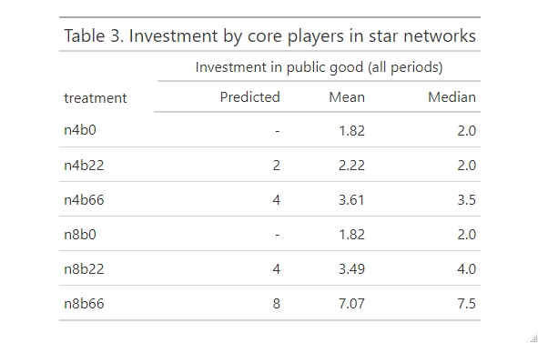
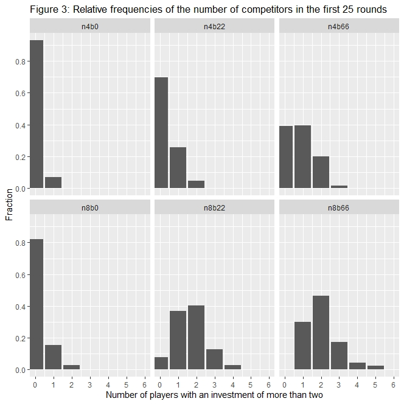

---
output:
  word_document: default
  html_document: default
  pdf_document: default
---

#< ignore

```{r "0_1"}
run = function(){
  library(RTutor)
  setwd("C:/Users/alex/Desktop/MA real/Masterarbeit/data/R")
  ps.name = "myps"; sol.file = paste0(ps.name,"_sol.Rmd")
  libs = c("ggplot2", "igraph") # character vector of all packages you load in the problem 
  libs = c(libs,"igraph", "tcltk", "dplyr", "zoo", "gt", "shinyMatrix", "shinyjqui", "shinyjs", "shinydashboard", "shinyWidgets")
  name.rmd.chunks(sol.file)
  create.ps(sol.file=sol.file, ps.name=ps.name, libs=libs, addons = "quiz")


  show.ps(ps.name,launch.browser=TRUE,
  auto.save.code=FALSE,sample.solution=FALSE)
}
run()

```

#>


## Exercise Competiton for status creates superstars

<head>
<style>
.TheoremBox {
  background-color: #58D68D;
  width: 1000px;
  border: 7px solid #1E8449;
  border-radius: 15px;
  padding: 30px;
  margin: 20px;
}
.LemmaBox {
  background-color: #F2D7D5;
  width: 1000px;
  border: 7px solid LightCoral;
  border-radius: 15px;
  padding: 30px;
  margin: 20px;
}
.DefinitionBox {
  background-color: #AED6F1;
  width: 1000px;
  border: 7px solid #3498DB;
  border-radius: 15px;
  padding: 30px;
  margin: 20px;
}
</style>
</head>

Author: Alexander Winter

Welcome to this RTutor set! This is an interactive problem set and a component of my Master’s thesis at the University of Ulm. This work explores the dynamics of a public good game, where players form networks between each others. It is based on the paper titled “Competition for status creates superstars: An experiment on public good provision and network formation” authored by Boris van Leeuwen, Theo Offermann, and Arthur Schram, and published in the Journal of the European Economic Association in 2020. For more detailed information, you can download the paper from the link https://academic.oup.com/jeea/article/18/2/666/5360168. There exist also online Appendixes as well as the stata reproduction code, which you can find here.

In the following, there will be exercises in form of code chunks or simple multiple choice tasks. How the problem set works will be explained starting with the first task. How to solve this problem set on your own computer is described on my github page https://github.com/winteralex99/superstar. Let's jump to the introduction!


## Exercise Introduction


As Luvreen et al. point out in [1], there are many motivating examples for our underlying theoretical game. In this thesis, I mainly will motivate the model by using a specific example from the animal rich. It will fit quite well in some key scenarios, while also having some issues to depict the model in a few other cases, as we will discover later. <br> <br>
Now first of all, I want to recapitulate some of the examples from [1], since they are quite easy to understand, due to being part of the everyday life. <br>

- Amateur Football Coach: Let's consider an amateur team of eight year old boys which needs some coaches to train them. Often times in reality, a few of the parents take over this job without getting payed for it. They create benefit for the whole group of parents, because every kid gets trained, while they have some costs in the form of the invested time for example. On the other hand, there are also parents which just profit from the investment of the coaches, while never invest anything by themselves. 

- Contribution to Wikipedia: According to Wikipedia, they had around 70 thousand active authors in Germany in 2015 [WIKI1]. On the other hand, a survey in 2015 revealed, that around 80% of all German internet users use Wikipedia frequently [WIKI2], which are millions of people. The authors create benefit for every German speaking, since every one has access to the information they provide. On they other hand, they also have some costs in form of invested time for example, while not getting payed for their work. 

<br>
The two examples have some things in common. I will refer to it now as if they would play a game, to get familiar with this expressions. First of all, there exists a small group of players which provides a good for the totality of the players. The players in the small group do not profit in a better way from their public good than the other players. Additionally, they have some costs to provide their good, which the other players do not have. This seems not very rational at first glance
<br>
Though, this can be regarded as playing for an efficient outcome, in a sense that the overall cost is minimized for the maximum payoff. In other words, the welfare of the whole group gets maximized. On the other hand, such an altruistic behavior can only barely be observed in laboratory experiments, if the nash equilibrium only overlaps with the efficient outcome in a repeated game, for example see [3] and [4]. Thus, it's very rare.
<br>
One idea to explain this behavior, is that players compete for status. In both of the above examples, we can imagine a type of social or psychological return in trade of for the costs of investing in a public good. For example, if the parents of a child coach its football team, maybe the parents get more popular among other parents. Or, very likely their child gets popular within the team. In the example with the Wikipedia authors, there might be a prestige thinking, for example that authors get a positive feeling if they write articles, which get huge view numbers. Therefore, the investing players receive some kind of extra benefit, with which we want to explain their investment. In the further course, we will refer to such kind of benefits as status rents.


## Exercise 1. The Game


# The Ruffs

Let me introduce the species of the Ruffs. The following information is from Lamichhaney S. et al. in [6].  It is a species of bird that is common in the bogs of northern Eurasia. They have a complex mating system and we will consider the behavior of the males in more detail. Roughly speaking, there are two distinct groups of males, the independents and the satellites, which have a different plumage. The independents have a dark or colored plumage around the ruff and head, while the satellites have a white plumage. Below is one picture of an independent male and one of a satellite male:

<br> <br>

<br> <br>

We will now model a simplified version of their mating process, where males have to compete with each other. Both groups have a different mating approach, but we will discuss this later. For now, we put them both in the same pot. For the males, there are generally two different approaches to find a mating partner: 
- The first approach is to claim a small territory on which the females are secure and thus are willing to pair. The benefit of this strategy is a high copulation rate with females. The downside of this strategy is, that the territory has to be defended against other males and animals, which can be energy consuming. In our model, a male has to decide on how much energy he is willing to put in for the defense of his territory.
- The second approach is to sneak into a strangers males territory. The benefit of this strategy is the meeting with females who are ready to pair and protection from enemies, without the energy consuming defensive duty of the territory. The downside of this strategy are the possible attacks by the territory owner, who might not tolerate strange males in his territory.

Now a strategy of a male consists of a combination of this two approaches, where usually only one of them is considered. To match our theoretical model, we imagine that the males can also go for a strategy which combines both approaches at the same time. While this not really matches up with the birds example, it won't play a big role in our later results anyway. 
<br>
To model the sneaking approach in an abstract way, we use the graph notation. A graph typically consists of vertices which can be connected to each other by links The next picture shows three different types of links, where we have to decide which one fits the model in the best way.

<br>
<br>


<br>
<br>

#< quiz "A first example graphs"
question: The vertices of the graphs represent the males. Which type of links gives a senseful representation for the sneaking approach? 
mc:
    - undirected links
    - directed links*
    - self-directing links

success: Great, your answer is correct!
failure: Try again.
#>
<br>
Let me explain this. If a male decides to sneak into another males territory, the underlying relation is only one sided, since the other male does not necessarily has to sneak in the first males territory too. Therefore, directed links match better with the model than undirected links. Furthermore, a self-directing link would refer to the case where a male sneaks in his own territory and profits from his own energy investment, which we already assume. Therefore, we will not allow them in the further discussions, to prevent unnecessary complications.

<br>
<br>
The following graph network provides an example of the relations between birds considering their sneaking approach. We will stick to the convention that an incoming link refers to a ruff which sneaks into the related territory:
<br>
<br>

<br>
<br>

#< quiz "First bird graph"
question: Consider the above network. Which of the following statements are true? 
mc:
    - Ruff 1 sneaks into Ruff 2's territory*
    - Ruff 2 sneaks into Ruff 1's territory

success: Great, your answer is correct!
failure: Try again.
#>
<br>
Lastly, let's talk about the status rents. One peculiar in this mating behavior is, that the males who claim their territory also profit from the males who sneak into it. Every additional sneaking male seems to make the territory more popular, so that even more females get attracted by the territory. This leads to a higher copulation rate of the males who own the territory, if sneaker males are present.

# Mathematical Model of the Game

Now, let's look at a proper mathematical model of the game, which abstracts the above relations. 
<br>
<br>
The game is played by $n$ players, which in our ruff example would be all of the males, in the coach example all of the parents. Each player $i \in N := \{1,..,n\}$ simultaneously has to decide about an investment size $x_i \in \mathbb{N}_0$ and a vector of links $g_i \in \{0,1\}^n$ which he wants to form to other players. At that, every entry $g_{ij}$ is $1$ if player $i$ forms a link to player $j$, and  otherwise is $0$. The $i$th entry of $g_i$ has to be $0$, since self-directing links are not allowed. The vector $G = (g_1,...,g_n)$, which consists of the linking decisions of all $n$ players, defines a directed network architecture. An example for such a network architecture is the network from PLOT.
<br> 
We conclude, that the tuple $s_i := (x_i,g_i)$ denotes a strategy for player $i$. Combining the network architecture $G$, which arises from the linking decisions, with the vector of investment decisions $x := (x_1,...,x_n)$ of all players, $s := (x,G)$ defines a strategy profile. Further we define $S$ as the set of all possible strategy profiles $s$. 
<br>
<br>
Now let's discuss how the payoffs come about. By linking to player $j$, player $i$ profits from $j$'s investment. We define the out-neighbors $N^{Out}_i(G) := \{j\in N: g_{ij} = 1\}$ as the set of players that $i$ links to with $d^{Out}_i(G) := |N_i^{Out}(G)|$ as out-degree of $i$. Analogous, we define the in-neighbors and the in-degree of $i$, i.e. $d^{In}_i(G) = |N^{In}_i(G)| = |\{j\in N: g_{ji} = 1 \}|$. 
<br>
The total investment that player $i$ accesses is now denoted as $y_i = x_i + \sum_{j \in N^{Out}_i(G)}x_j$. This simply is the sum of the units in which he invests by himself and the units which he accesses through his links. In our model, player $i$ values it's own investment the same way as the investments from other players to which he has access to. The total investment gets evaluated by a concave and increasing function $f$ with $f(0) = 0$, so that the benefit of the accessed units of player $i$ is $f(y_i)$. <br>
Every investment comes with a constant cost of $c > 0$ per unit and every link with a constant linking cost of $k > 0$. In contrast, players get a reward of $b \geq 0$ per incoming link, called status rent. To ensure that there won't arise cycles where players profit from each other only by linking without any investments, we have to set $k > b$. <br> 
Overall we get the following payoff function for player $i$: 
$$\pi_i(s) = f(y_i)-cx_i-kd^{Out}_i(G)+bd_i^{In}(G)$$
 
On this basis, let's try to calculate some payoffs. In our experiment, the values $c$ and $k$ are fixed with $c = 55$ and $k = 70$, while the parameter $b$ varies between the values $0$, $22$ and $66$. For the current calculations, let's just assume $b = 22$. Also, the evaluating function $f$ is fixed in the experiment. Later we will investigate it in more detail, but to keep things simple, let's just assume $f(2) = 152$ for now. This leads to the more specific payoff function:
$$\pi_i(s) = f(y_i)-55x_i-70d^{Out}_i(G)+22d_i^{In}(G)$$


#< quiz "the game payoff 1"
question: Consider now the network of birds from above. Which payoff of the following payoffs is correct, if player $2$ invests in $x_2=2$ units and the other players invest in $x_1$ = $x_3$ units?
mc:
    - \(\pi_1 = 82\)*
    - \(\pi_1 = 152\)
    - \(\pi_2 = -6\)*
    - \(\pi_2 = 42\)
    - \(\pi_3 = 152\)
    - \(\pi_3 = 22\)*
    
success: Great, your answer is correct!
failure: Try again.
#>


<br>

As you can see, the payoff function is quite intuitive. Nevertheless it can become quite annoying to calculate the payoffs every time by hand. For this purpose I created a dashboard where you can set the investments of the players and the network architecture and get the payoff of the players in return. It is limited to the case of $n=4$ players, which will be a important case in our later investigations. You can find it under the chapter 'Appendix 1: Payoff Tool'. Feel free to play around a little bit and use it for the exercises.

#! start_note "Payoff Calculator (if an error occurs, press here again two times)"

<br>
<br>
<iframe height="1200" width="1000" frameborder="no" src="https://alexwinter.shinyapps.io/myapp/"> </iframe>
<br>
<br>

#! end_note

#< quiz "the game can someone improve?"
question: Later we are interested in optimal ways of playing the game. Without any further explanations, do you think a player can improve his payoff by deviating from his current strategy?. If so, which player(s)?
mc:
    - No one can improve.
    - Player \(1\) can improve.
    - Player \(2\) can improve.*
    - Player \(3\) can improve.*
    
success: Great, your answer is correct!
failure: Try again.
#>

#! start_note "Explanation (Spoiler!)"

First of all, Player $3$ can easily improve by linking to palyer $2$, which increases his payoff from $0$ to $82$. 
<br>
Secondly, Player $2$ can obviously improve by investing in zero units and chancelling his link, since he currently receives a negative payoff which would then increase to $22$. On the other side, this would not be his best deviaton strategy, since he also only can cancel his link which just decreases his payoff by $70$ without any reward. In fact, this would be his best strategy which would lead him to an payoff of $64$. We will investigate this later in more detail. 
<br>
Lastly, Player $1$ can not improve. We give the explanation for that later.

#! end_note


## Exercise 1.1 The Experiment

Now that I introduced the game, let's have a look at the experiment. In [1], Luvreen et al. ran the game as a 75 times repeated game with different parameter settings. Each round, the participants were able to look up the game history, i.e. the outcomes of the rounds before, and had to decide about an investment and a linking vector. The fixed parameters are cost per unit $c = 55$, the cost per link $k = 70$ and the evaluating function $f$, while the player count $n$ and the status rents $b$ gets varied systematically. The evaluating function will get investigated in a later chapter.
<br>
The following data set contains every single decision of the players. Therefore, let's have a look at it. For this, load the data set `dat.csv`, use the command `read.csv()` to safe it in the variable `dat` and print the first five lines using the command `head()` by replacing the question marks. 
<br>
<b>Task:</b> Press edit, substitute the ???'s correctly and run code chunk by pressing the check button. 

```{r "4_1"}
#< task_notest
#??? = read.csv('???.csv')
#head(???,5)
#>
dat = read.csv('dat.csv')
head(dat,5)
```

<br>
This is the data set with which we will work in the further. First of all, we observe that every row contains a decision of a player. We want to get more information about the experiment. Therefore, we want to check which different treatments got played in the experiment. To investigate this, we want to print out the values of the column `treatment` without double values. For this purpose, you can use the command unique() on this column. You can access a specific column `c` by writing dat$c.
<br>
<b>TODO:</b> Replace the ???'s in the right way, then uncomment the commands and run the chunk.
```{r "4_2"}
#< task_notest
#???(dat$???)

#>
unique(dat$treatment)
```
<br>
Great. As we can see, there are eight different treatments, with values of 4 and 8 for $n$, 0, 22 and 66 for $b$ and two treatments with the EXO appendix. These are special treatments which the authors in [1] created, as a kind of control treatments, to get more information about the motivation of the players. In the exogenous treatments, the links of the networks are exogenous imposed, which means, that the are predetermined. The players don't have the ability to decide about their links, they only can decide about their investment, knowing the network structure. The predetermined networks are taken from normal, called endogenous, treatments, with the same parameter settings as in the relating exogenous treatments.
<br>
As next, we want to gain some more information about the organizatoric structure of the experiment. The following table from [1] gives an overview over the treatments and of the groups. For more details about the execution of the experiment and the participants you can look up the paper of Luvreen et al. in [1]. 
<br>
<br>

<br>
<br>

A majority of the other columns are pretty self explaining, but for some you maybe need more details. For this, I give an explanation for every different column in the following note:

#! start_note "Detailed Explanation of the columns"
- `investment`: The number of units in which the related player decides to invest, reaching from 0 to 10, while it has no upper bound in theory.
- `la` to `lh`: If the player related to the current row decides to link to the player with role x, then the values of the column `lx` is 1, otherwise it is 0.
- `n`: Gives the number of players in the current group, with a value of either 4 or 8.
- `b`: Gives the level of the status rent, with values or either 0, 22 or 66.
- `exolinks`: If a treatment is played where the links are exogenous imposed, the value is 1, otherwise it is 0.
- `payoff`: Gives the payoff of the related player in the related round, reaching from -608 to 504.
- `round`: The round in which the related decision was committed, reaching from 1 to 75.
- `star`: If the related network is a star network, the value is 1, otherwise it is 0. 
- `core`: If the related player is the core player of a current star network, the value is 1, otherwise it is zero.
- `role`: Gives an identifier for the participants in their specific groups, reaching from a to d or a to h, depending on the group size.
- `group`: Gives the group, in which the related participant played the game. In every session there are at least the groups 1 and 2, in session one there are the most groups with a count of seven.
- `session`: Represents the session in which the related decision took place. In total there were 15 session, the values in the column are reaching from 1 to 16, excluding the 13.
- `bet`: At the beginning of each 75 times repeated game, each participant got a chance to gamble with an arbitrary number of points between 0 and 600. With a chance of 50%, the stake got multiplied by 2.5 and returned to the participant, in the other 50% case the participant lost the stake. The column bet gives the number of gambled points of related the participant.  
- `totearnings`: Gives the total payoff of the related player including the starting capital of 2000 points, the outcome of the gamble and the gained points in every one of the 75 rounds. The values are given in euros with a conversion rate of 10 cents equal 30 points. They reach from 5.7€ to 125.5€.
- `treatment`: This column contains the combined information from the column n, b and exolinks for the purpose to simplify the code for the plots later on.
<br>


#! end_note


<br>


Now we want to investigate a single stage outcome of the game, to analyse the network structure and the investments.
#< quiz "which pars "
question: Which columns do we need to specify, in order to get exactly the rows of decisions of the $n$ player of a stage game
mc:
    - n
    - b
    - group*
    - session*
    - round*
    - role
    - treatment
success: Great, your answer is correct!
failure: Try again.
#>
<br>
For example, let's have a look at first session, group one in the eight round. To filter this specific rows out, use the command `subset()` on out data set `dat`.<br>
<b>Task:</b> Uncomment the subset command and replace the ???'s with the right values.
```{r "4_3"}
#< task_notest
#subset(???, session == ??? & groep == ??? & round == ???)
#>
subset(dat, session == 1 & group == 1 & round == 8)
```

<br>
Nice! The main columns that we are interested in are `investment` and `la` to `lh`. `investment` contains the investment levels of the players in this round, while `lx` gives the information if the player related to the current row has a link to the player with the role x or not. 

#< quiz "network s1g1r2"
question: With the explanation and the table from above in mind, which statement is true?  
mc:
    - Player A links to player B.*
    - Player D links to player C.
    - Player A invests in 3 units.
    - Player B invests in 3 units.*
    - Player D invests in 1 unit.
    
success: Great, your answer is correct!
failure: Try again.
#>
<br>
To read the network architecture from the table is quite unhandy, therefore let's create a function which plots a network from the input of a specific group, session and round. I provide the code in the following chunk:
<br>
<b>Task:</b> Run the chunk

```{r "4_4"}
#< task_notest
plot_network = function(Session, Group, Round){
  sub_data = subset(dat, session == Session & group == Group & round == Round)
  if(sub_data$n[1] == 4){
    Layout = matrix(c(0,0,1,1,0,1,0,1),4,2)
    A = matrix(c(sub_data$la, sub_data$lb, sub_data$lc, sub_data$ld), 4, 4)
  }
  if(sub_data$n[1] == 8){
    Layout = matrix(c(0,0,1,2,3,3,2,1,1,2,3,3,2,1,0,0),8,2)
    A = matrix(c(sub_data$la, sub_data$lb, sub_data$lc, sub_data$ld, sub_data$le, sub_data$lf, sub_data$lg, sub_data$lh), 8, 8)
  }
  plot_colors = c('#5bc0de', '#5cb85c', '#d9534f', '#337ab7')
  g = graph_from_adjacency_matrix(A, mode = 'directed')
  V(g)$color = plot_colors
  E(g)$width <- 2
  E(g)$color = "black"
  plot(g, layout = Layout, main=paste('Network of session', Session, ', group', Group, 'and round', Round), vertex.size=100,edge.arrow.size=1.5)
}

#>
plot_network = function(Session, Group, Round){
  sub_data = subset(dat, session == Session & group == Group & round == Round)
  if(sub_data$n[1] == 4){
    Layout = matrix(c(0,0,1,1,0,1,0,1),4,2)
    A = matrix(c(sub_data$la, sub_data$lb, sub_data$lc, sub_data$ld), 4, 4)
  }
  if(sub_data$n[1] == 8){
    Layout = matrix(c(0,0,1,2,3,3,2,1,1,2,3,3,2,1,0,0),8,2)
    A = matrix(c(sub_data$la, sub_data$lb, sub_data$lc, sub_data$ld, sub_data$le, sub_data$lf, sub_data$lg, sub_data$lh), 8, 8)
  }
  plot_colors = c('#5bc0de', '#5cb85c', '#d9534f', '#337ab7')
  g = graph_from_adjacency_matrix(A, mode = 'directed')
  V(g)$color = plot_colors
  E(g)$width <- 2
  E(g)$color = "black"
  plot(g, layout = Layout, main=paste('Network of session', Session, ', group', Group, 'and round', Round), vertex.size=100,edge.arrow.size=1.5)
}
```

<br>
Now let's plot the network from the subset above, i.e. the network in session one, group one and round eight.
<br>
<b>TODO:</b> Execute the command `plot_network()` with the right parameters.
```{r "4_5"}
plot_network(1, 1, 8)

```

Nice! To make things easier, I coded a shiny application where you can put in the session, group and round of a network and get the network, the status rent, the exolink variable and the investments as outputs. Feel free to play around with it and check out some networks.


<br>
#! start_note "Network Visualizer (if an error occurs, press here again two times)"
<iframe height="1400" width="1000" frameborder="no" src="https://alexwinter.shinyapps.io/myapp2/"> </iframe>
#! end_note
<br>


## Exercise 2.1 Theory: Analysis of the One Shot Game

After introducing the theoretical model, our main goal is to predict the outcome of the experiment, at best in relation to an underlying theory. For this reason we start analyzing the one shot game, in order to identify optimal ways of playing the game.

# Nash Equilibrium

First, we consider the concept of a Nash Equilibrium. Simply spoken, a (strict) Nash Equilibrium is reached, whenever every player plays a strategy and is not able to improve his own payoff (weakly) by deviating from his own strategy, if all the other players do not change their strategies. Let's formalize this properly:


<div class="DefinitionBox">
<b>Definition 1: </b> <br>
A strategy profile \(s = \{s_1^*,\dots,s_n^*\}\), where \(s_{i}^*\) denotes player \(i\)'s strategy, is called a <b>Nash Equilibrium</b> (NE), if for all players \(i \in N\) the following holds:
\[\pi_i (s_i^*,s_{-i}^*) \ge \pi_i (s_i,s_{-i}^*) \ \forall s_i \in S_i\]
Additionally, \(s\) is called a <b>strict Nash Equilibrium</b> (strict NE), if for all players \(i \in N\) the following holds: 
\[\pi_i (s_i^*,s_{-i}^*) > \pi_i (s_i,s_{-i}^*) \ \forall s_i \in S_i \setminus \{s_i^*\}\]
</div>


# Total Equilibrium Investment 

To identify Nash Equilibria in the one shot game, we first consider a simplified version of the game, where there is only $n = 1$ player. Clearly, he has no possibility to link to other players, so only investing is possible. 

#< quiz "f conc"
question: If we just assume, that the evaluating function $f$ is strictly concave, which statement would follow from that?
sc:
    - The profit per invested unit decreases with an increasing investment level.*
    - The profit per invested unit increases with an increasing investment level.
    - The profit per invested unit remains the same with an increasing investment level.
    
success: Great, your answer is correct!
failure: Try again. Remember, that $f$ is concave!
#>
<br>
This is a necessary condition for the game, since otherwise unlimited payoff gains by investing in an unlimited number of units would be possible. Therefore, with a strictly concave evaluating function \(f\), there has to be an optimal number of units in which player \(1\) should invest. This leads to the next definition:
<div class="DefinitionBox">
<b>Definition 2:</b> <br>
Let \(f\) be a concave evaluating function with \(f(0)=0\) and \(c>0\) the cost of investing per unit. Then the value 
\[\hat y = \underset{{x\in \mathbb{N}}}{\text{argmax}}\{f(x)-cx\}\]
is called <b>Total Equilibrium Investment</b>.
</div>
In [1], van Luvreen et al. call \(\hat y\) the "optimal public good investment if
players were to act in isolation". This definition fits perfectly to the simplified version with \(n=1\) players. However, as we will discover later, the value \(\hat y\) will play an important dual role as it also denotes the total number of units invested in a strict Nash Equilibrium. <br>

Simply spoken, \(\hat y\) is reached whenever the costs overcome the gain of an additional unit. In order to make the concept of \(\hat y\) clearer, the next exercise will give you a concrete example from the experiment.
<br> 
<br>

The values of the function $f$ which is used in the experiment are stored in the file `f.csv`. Load the data set via the command `read.csv()` and store it in the variable `f`. After that, print out the first 5 lines with the command `head()`.
<br>
<b>Task: </b> Run the code chunk.
```{r "5_1"}
#< task_notest
f = read.csv('f.csv')
head(f,5)
#>

```


#< quiz "f yhat"
question: Now look at the five entries. If we again assume $c = 55$ as in the experiment, is it already possible to deduct the value of $\hat y$? If so, what is the value of it?
sc:
    - No.
    - Yes, it is \(1\).
    - Yes, it is \(2\).*
    
success: Great, your answer is correct!
failure: Try again. Remember, that $f$ is concave!
#>
<br>

Let's check this answer in a graphical way by looking a the following plot, where the functions $f(x)$ and $f(x) - 55x$ are visualized:

<br>


<br>

Indeed, by looking at the maximum of the lower function, the correct value is $\hat y = 2$, so in the NE, player $1$ would invest in two units.
<br>
<br>
Now we want to investigate the general $n\in \mathbb{N}$ case. Let's imagine some network $G$ and some investments by the players. In a NE, there can not exist a player who accesses less than $\hat y$ units, since otherwise he would be able to improve his payoff by investing in one more unit. Important to notice is, that it is not relevant if the units come from a link or by self investing. This leads to the following rule:
<br>
<b>Rule $1$: In a NE, player $i$ has to access as least $\hat y$ units.</b>
<br>
<br>
On the other hand, let us assume player $i$ accesses more than $\hat y$ units in a NE. If he just accesses them by linking other players, a general claim about the optimality of his decision is difficult to make. 

#< quiz "rule2"
question: Which statement is true, if player $i$ accesses more than $\hat y$ units and also has a positive investment level, i.e. $x_i>0$?
mc:
    - He can not improve his payoff.
    - He can improve his payoff by lowering his investment by \(\text{min}\{x_i,|\hat y-y_i| \}\) units.*
    - He can improve his payoff by lowering his investment by one unit.*
    
success: Great, your answer is correct!
failure: Try again.
#>
<br>
Let me explain this. The truth of the last statement follows directly from the definition of \(\hat y\). If player \(i\) reduces his investment just by one unit, he still accesses at least \(\hat y\) units and gets rid of one unit for which the costs overcome the benefit. The second statement is also true, with a similar argument, namely that if player \(i\) reduces his payoff by \(\text{min}\{x_i,|\hat y-y_i| \}\), he also still at least accesses \(\hat y\) units. This can easily shown by a case distinction. The following rule summarizes our discouvery:
<br>
<b>Rule \(2\): In a NE, if player \(i\)'s investment is positive, i.e. \(x_i>0\), he has to access at most \(\hat y\) units. </b>
<br>
<br>
Both rules now get summarized by the following Lemma:
<br>
<br>

<div class="LemmaBox">
<b>Lemma 1: </b><br>
In a strict Nash Equilibrium, every player \(i\) accesses at least \(\hat y\) units. If player \(i\) additionally invests in a positive number of units by himself, i.e. \(x_i>0\), then he has to access exactly \(y_i = \hat y\) units.
</div>


# Nash Equilibria in Networks with two players

To get some more intuition about Nash Equilibria in networks, let us investigate the case with $n=2$ players. Since the linking possibilities are quite limited, the following three network architectures are the only possible ones to arise, if we treat $G_1$ the same way as its symmetrical mirrored network. 
<br>


<br>

We want to find every Nash Equilibrium in the $n=2$ case. Although the players in the game decide about their links and investments simultaneously, in the further analysis we first assume that the given network architecture is fixed to get the optimal investment levels. After that, we check if a player wants to deviate by changing his linking decision, possibly with his investment decision. In this way we create a clear structure in our analysis. Now let's dive into it.
<br>
<br>
$G_0$<b> with zero links:</b> 
<br>
#< quiz "G0"
question: What do you think, are there investment levels which together with the fixed network structure form a NE? If so, which ones?
mc:
    - There is no NE possible with \(G_0\) as a network.
    - The investment levels \(x_1=x_2=\hat y\) together with \(G_0\) form a NE.*
    - The investment levels \(x_1=x_2=\frac{\hat y}{2}\) together with \(G_0\) form a NE.
    - The investment levels \(x_1=\hat y\) and \(x_2=0\) together with \(G_0\) form a NE.
    - The investment levels \(x_1=0\) and \(x_2=\hat y\) together with \(G_0\) form a NE.
    
success: Great, your answer is correct!
failure: Try again.
#>
<br>
This case is quite easy, since in a fixed network both players act like in the \(n = 1\) case by simply investing in \(\hat y\) units, which leads to a payoff of \(\pi_1^{G_0}= \pi_2^{G_0} = f(\hat y) - \hat yc\).
<br>
<br>
\(G_1\)<b> with one link:</b> 
<br>
#< quiz "G1"
question: What do you think, are there investment levels which together with the fixed network structure form a NE? If so, which ones?
mc:
    - There is no NE possible with \(G_1\) as a network.
    - The investment levels \(x_1=x_2=\hat y\) together with \(G_1\) form a NE.
    - The investment levels \(x_1=x_2=\frac{\hat y}{2}\) together with \(G_1\) form a NE.
    - The investment levels \(x_1=\hat y\) and \(x_2=0\) together with \(G_1\) form a NE.
    - The investment levels \(x_1=0\) and \(x_2=\hat y\) together with \(G_1\) form a NE.*
    
success: Great, your answer is correct!
failure: Try again.
#>
<br>
In this case, player \(2\) has no outgoing link, which means he only accesses his own investment units. Therefore, his optimal strategy is to invest in \(\hat y\) units for a payoff of \(\pi_2^{G_1} = f(\hat y) -\hat y c + b\). Player \(1\) accesses now \(\hat y\) units by linking to player \(2\) and thus does not invest by himself in order to play the optimal strategy, see rule \(2\). He receives a payoff of \(\pi^{G_1}_1 = f(\hat y) -k\).
<br>
<br>
\(G_2\)<b> with two links:</b> 
<br>
#< quiz "G2"
question: What do you think, are there investment levels which together with the fixed network structure form a NE? If so, which ones?
mc:
    - There is no NE possible with \(G_2\) as a network.
    - The investment levels \(x_1=x_2=\hat y\) together with \(G_2\) form a NE.
    - The investment levels \(x_1=x_2=\frac{\hat y}{2}\) together with \(G_2\) form a NE.*
    - The investment levels \(x_1=\hat y\) and \(x_2=0\) together with \(G_2\) form a NE.*
    - The investment levels \(x_1=0\) and \(x_2=\hat y\) together with \(G_2\) form a NE.*
    
success: Great, your answer is correct!
failure: Try again.
#>
<br>
There seem to be many ways to achieve a NE, and those aren't even all the solutions! In the third case with the two links, both players access the others investment. Therefore, if the sum of both investments equals the optimal public good investment \(\hat y\), i.e. \(x_1+x_2=\hat y\), by the rules \(2\) and \(2\) from above, no player would invest more or less that his current investment. Therefore, the payoff of player \(i\) is \(\pi^{G_2}_i=f(\hat y)-x_ic-k+b\).
<br>
<br>
Now it is up to check if and when the players want to deviate from their networks. In the network \(G_0\), both players can only deviate to the role of player \(1\) in the network \(G_1\), so to prevent deviation, \(\pi^{G_0}_1 \ge \pi^{G_1}_1\) has to hold. This formula simplifies to the condition \(k\ge \hat y c\). Practically speaking, the formula just means if it's cheaper to access \(\hat y\) units by a link than by self investing, then it is reasonable to deviate.  
<br>
Now consider the network \(G_1\). Player \(2\) has no motivation to deviate from the current network structure, since then he would have to link to player \(1\) whose investment is \(0\), and therefore player \(2\)'s payoff would just drop by the linking cost \(k\). On the other hand, player \(1\) will deviate to the \(G_0\) network by canceling his link and investing in \(\hat y\) units if the condition \(\hat y c \ge k\) fails, which is the reversed one from the last case. Her the same rational applies: If it's cheaper to self invest in \(\hat y\) units than link to player \(2\), player \(1\) will deviate.
<br>
In the network \(G_2\), player \(i\) possibly can deviate to player\(2\) in the \(G_1\) network by canceling his link and investing in \(\hat y\) units. In order to prevent deviating, the cost for self investing should be higher or equal than the cost for the current link, which the relation \(\pi^{G_2}_i \ge \pi^{G_1}_2\) shows, since it simplifies to \(x_{-i}c \ge k\). Since in a NE both players should not deviate, the condition \(\text{min}\{x_1c,x_2c\} \ge k\) has to hold. Notice that the most robust network would be if \(x_1=x_2=\frac{\hat y}{2}\) holds. 
<br>
<br>

#< quiz "2players NE"
question: Assuming $n = 2$ players and the parameters from the experiment $c = 55$ and $k = 70$, for which network architecture is a Nash Equilibrium possible?   
mc:
    - \(G_0\)
    - \(G_1\)*
    - \(G_2\)
    
success: Great, your answer is correct!
failure: Try again. Use $\hat y$ from above!
#>

<br>
The solution follows directly from the formulas above. With \(c = 55\) and \(k = 70\), we have \(k<\hat y c\) is the same as \(70<2\cdot55\), and therefore the setting from \(G_0\) cannot be a NE. On the other hand, the same relation shows that the setting from \(G_1\) is a NE. To investigate \(G_2\), we assume \(x_1=x_2=\frac{\hat y}{2} = 1\), which leads to \(x_ic = 55 < 70 = k\), which contradicts a NE.
<br>
<br>
Let us summarize this chapter: When investing in \(\hat y\) is less expensive than linking to a player, \(G_0\) forms a NE network. If it is the other way around, \(G_1\) is a NE network, and if additionally the fraction \(\frac{k}{c}\) is even more complaisant by being small enough, the network \(G_2\) also is a NE network.
<br>
Also important to note is, that the status rent \(b\) does not play any role in deciding about a NE, which is reasonable, since no player has any ability to decide if another player links to him to gain him the status rent. 
<br>
In the further course we will disregard the case \(k>\hat y c\), since it is easy to show that this property always leads to a NE where there network is empty, which is not really interesting. 
<br>
Additionally, we also want to disregard the case \(k=\hat y c\). It is easy to see that this case always creates an unnecessary large number of Nash Equilibria, because the players are often times indifferent in self investing or linking to other players who invest in \(\hat y\) units. 
<br> 


# Nash Equilibria in Networks with four players

Since the two players examples are quite primitive, let's have a look at some examples of the $n=4$ case, to get an idea of which structures are necessary to provide a NE. In our experiment, half of the treatments are with $n=4$ players, so this section gets quite important. With Lemma 1, we now also have a powerful tool to analyse the networks better. 
<br>
<br>

Now first of all, consider the following network:
<br>

<br>
#< quiz "G3"
question: Is it possible, that $G_3$ arises within a NE? If so, what are the corresponding investments?   
mc:
    - No, it is not possible.*
    - Yes, with investment levels of \(x_4=\hat y\) and \(x_1=x_2=x_3=0\).
    - Yes, with investment levels of \(x_2=x_4=\frac{\hat y}{2}\) and \(x_1=x_3=0\).
    
success: Great, your answer is correct!
failure: Try again. Use Lemma 1!
#>
<br>
Assume, this network appears in a NE. Since player \(4\) has no outgoing link, he invests in \(x_4=\hat y\) units to be optimal. Now player \(2\) already accesses \(\hat y\) units trough his link, and therefore invests in \(x_2=0\) units himself, by Lemma 1. This leads to a contradiction, since player \(1\) links to player \(2\), but this link only costs him \(k\) and gains him no additional units. So it would be rational to deviate and cancel this link, and therefore the current network can not appear in a NE. The example suggests, that somehow the path from player \(1\) to player \(4\) over player \(2\) seems to generate a problem. The same holds for the path between player \(3\) and player \(4\) over player \(2\), since it is the symmetric case. On the other hand, one can argue that the link from  player \(2\) to player \(4\) might be a problem. 
<br>
<br>

Therefore, let's first investigate the network, where the two incoming links from player $2$ are deleted:
<br>

<br>
#< quiz "G4"
question: Is it possible, that $G_4$ arises within a NE? If so, what are the corresponding investments?
mc:
    - No, it is not possible.
    - Yes, with investment levels of \(x_2 = x_4=\frac{\hat y}{2}\) and \(x_1=x_3=0\).
    - Yes, with investment levels of \(x_4=\hat y\) and \(x_1=x_2=x_3=0\).*
    
success: Great, your answer is correct!
failure: Try again. Use Lemma 1!
#>
<br>
This network is a star network. Player \(4\) again invests in \(\hat y\) units, since he has no outgoing links. The other players already access \(\hat y\) units through their links, so by Lemma 1 they invest in \(x_1=x_2=x_3 = 0\) units. In this case, the non-investing players have no will to deviate into cancelling their link and investing \(\hat y\) by themselves as long as \(\hat yc > k\), and player \(4\) has not even a possibility to deviate in a senseful way, since he already invests the optimal amount of units and linking to non-investing players is not reasonable. Therefore, with the condition \(\hat y c>k\), \(G_3\) forms a NE network. 
<br>
<br>

The next network provides an example, where the link from player $2$ to player $4$ from the $G_3$ network got deleted:
<br>

<br>
#< quiz "G5"
question: Is it possible, that $G_5$ arises within a NE? If so, what are the corresponding investments?   
mc:
    - No, it is not possible.*
    - Yes, with investment levels of \(x_2=x_4=\frac{\hat y}{2}\) and \(x_1=x_3=0\).
    - Yes, with investment levels of \(x_2=x_4=\hat y\) and \(x_1=x_3=0\).
    
success: Great, your answer is correct!
failure: Try again. Use Lemma 1!
#>
<br>
To be a NE network, player \(2\) and \(4\) have to invest in \(x_2=x_4 =\hat y\) units, since they have no outgoing link. This would imply, that player \(2\) invests in \(\hat y\) units by himself instead of linking to player \(4\). So therefore, it is not possible that \(k < c\hat y\) holds. But even if we would allow the case \(k=c\hat y\), \(G_5\) can not be a NE network. In the note below, an explanation is given.

#! start_note "Explanation"

We know that \(k=c\hat y\) has to hold, because player \(2\) has to be invariant in investing two units and no link to anybody or linking to player \(4\) and investing in zero units. Furthermore, since player \(1\) has two outgoing links, \(k\leq(2\hat y)-f(\hat y)\) has to hold in order to prevent him from canceling one link. If we know play a little bit around with the formulas, the following contradiction occurs:
$$
k\leq f(2\hat y)-f(\hat y) = [f(2\hat y)-f(2\hat y -1)]+\ldots+ [f(\hat y+1)-f(\hat y)] \overset{*}{<} c\hat y = k
$$
The smaller sign with the star applies, because due to the definition of \(\hat y\), \(f(\hat y+m+1)-f(\hat y+m)<c\) has to hold for every non negative integer \(m\).

#! end_note
<br>
<br>

Since the $G_3$ network without the link from player $2$ to player $4$ is not a NE network, let us consider the $G_3$ network with an additional link from player $4$ to player $2$.
<br>

<br>
#< quiz "G6"
question: Is it possible, that $G_6$ arises within a NE? If so, what are the corresponding investments?   
mc:
    - No, it is not possible.
    - Yes, with investment levels of \(x_2=x_4=\frac{\hat y}{2}\) and \(x_1=x_3=0\).*
    - Yes, with investment levels of \(x_2=\frac{\hat y}{3}\), \(x_4=\frac{2\hat y}{3}\) and  \(x_1=x_3=0\).*
    - Yes, with investment levels of \(x_1=x_2=x_3=x_4=\frac{\hat y}{2}\).
    
success: Great, your answer is correct!
failure: Try again. Use Lemma 1!
#>
<br>
The sub network with only player \(2\) and player \(4\) can be treated the same way as the network \(G_2\) from the \(n=2\) example, since the only difference for their payoffs is one additional status rent \(b\), on which they have no influence anyway. Therefore, the units in which the players \(2\) and \(4\) invest have to sum up to \(\hat y\), i.e. \(x_2+x_4=\hat y\). This leads to the fact, that player \(1\) and player \(3\) access \(\hat y\) units, which means that they both invest in zero units, i.e. \(x_1 = x_3 = 0\), by LEMMA. Now we have to check, under which conditions the players won't deviate. Without loss of generality, let \(x_2 \le x_4\). Now the question for the players \(1\), \(3\) and \(4\) is, if their link to player \(2\) is worth the cost \(k\), since otherwise they can invest in \(x_2\) units by themselves. Therefore, it has to hold that \(k < x_2c\) and in general that \(k< \text{min}\{x_2c,x_4c\}\), which is the same condition as in the \(n=2\) case.
<br>
<br>

As a last network, consider the following cycle: 
<br>

<br>
#< quiz "G7"
question: Is it possible, that $G_7$ arises within a NE? If so, what are the corresponding investments?  
mc:
    - No, it is not possible.
    - It is not possible that \(G_7\) arises within a strict NE.*
    - Yes, with investment levels of \(x_1 = x_2=x_3=x_4=\hat y\).
    - Yes, with investment levels of \(x_1 = x_2=x_3=x_4=\frac{\hat y}{2}\).*
    - Yes, with investment levels of \(x_1 = x_2=x_3=x_4=\frac{\hat y}{4}\).
success: Great, your answer is correct!
failure: Try again. Use Lemma 1!
#>
<br>
In this one, every player \(i\) has an incoming link and therefore has to have a positive investment \(x_i > 0\). Therefore, \(y_i = \hat y\) has to hold for every player \(2\) by Lemma 1. Additional, \(x_1=x_2=x_3=x_4\) has to hold, since otherwise the player who links to the player with the lowest investment would deviate by cancelling his link and linking to the player (excluding himself) with the highest investment. This means that \(x_i = \frac{\hat y}{2}\) has to hold for every player \(i\). But this implies, that player \(1\) would get the same payoff in the current setting as if he would cancel his link and links to player \(3\), which contradicts a strict NE.

<br>
<br>
Let us summarize this. The two NE networks \(G_4\) and \(G_4\) have the common ground that there exists a set of players, in \(G_4\) only player \(4\) and in \(G_6\) the players \(2\) and \(4\), who provide the units to all other players and themselves. This is can  be seen as hint for the general case and gets proven in the next chapter. In \(G_3\), the links to player \(2\) are unnecessary and prevent a optimal distribution, in \(G_5\) the links between player \(2\) and \(4\) are missing, so they do not benefit from each other, which is also not optimal. The network \(G_7\) shows, that this kind of cycles can occur in a NE, but not in a strict NE. Also it is noticeable, that in the strict NE networks the overall sum of units in which got invested is always just \(\hat y\) which gives us also a hint for the general case. With this ideas in mind, let us jump to the next section.

#< quiz "which is NE from exp"
question: Now look at the following networks from the experiment. Which of them can possibly have a NE?
mc:
    - \(1\)*
    - \(2\)
    - \(3\)
    
success: Great, your answer is correct!
failure: Try again.
#>

# Core-Periphery Network

The examples from last section suggest, that in a strict NE there is a small group of players which supply all players with units. We now want to investigate this further, and therefore define this idea properly.

<div class="DefinitionBox">
<b>Definition 3:</b><br>
A network \(G\) is called <b>core-periphery network</b>, if the set of players \(N\) is divided in two sets \(N_C(G)\) and \(N_P(G)\), where every player \(i\in N\) exclusively forms a link to every other player in the core set \(N_C(G)\setminus\{i\}\).
</div>

This definition leads directly to the following theorem:

<div class="TheoremBox">
<b>Theorem 1:</b><br>
In every strict NE, a core-periphery network forms with the set \(N_C\) as core and \(N_P\) as periphery. The overall sum of units in which the players invest is exactly \(\hat y\), i.e. \(\sum_{i\in N}x_i^N = \hat y\). The size of the core is bounded by \(|N_C| < \hat y \frac{c}{k}\).
</div>

I proved this in a little bit more detail in the following section. You can unfold it by pressing the "Proof" Button.

#! start_note "Proof:"

The goal is to prove, that in every strict NE a core-periphery network is formed. <br>
To prove this, it is easier to prove another result first, namely $\sum_{i\in N}x_i^N = \hat y$. This means, that the overall sum of the investment units is exactly $\hat y$.
First of all, the sum can not be smaller than $\hat y$, because after the LEMMA every player accesses at least $\hat y$ units. 
Now we divide the players into the set $N_0$, which consists of all players with no incoming links, and the set $N_1$ which consists of all players with incoming links.
It follows directly, that the sum of the investments of all players with incoming links also at least has to be $\hat y$, i.e. $\sum_{i\in N_1}x_i^N \ge \hat y$. Since we want to prove equality here, let's assume $\sum_{i\in N_1}x_i^N > \hat y$ for a contradiction proof.
<br>

Before starting with the argument, we have to note two easy properties. First of all, by the nature of the sets $N_0$ and $N_1$, $x_i^N > x_j^N$ has to hold $\forall i \in N_1, j \in N_0$, since otherwise a player who links to $i$ can link to $j$ instead and improves. Secondly, $cx_i^N>k$ has to hold $\forall i \in N_1$, which means that the cost of linking to a player from $N_1$ has to be lower than the cost of selfinvesting in the same number of units which get accessed by linking. Otheriwse, the players from $N_0$ can just improve by canceling their links and invest in the missing units by themselfes. Also it follows that $x_i >0$, since $k > 0$ has to hold. <br>
<br>
Now after LEMMA it is clear, that every player in $N_1$ accesses exactly $\hat y$ units. But since we assume that the sum of all units from $N_1$ is greater than $\hat y$, for every player $i\in N_1$ there has to exist a player $j\in N_1$ to which $i$ is not linked to, i.e. $g_{ij} = 0$. If the $N_1$ players now get ordered by their investments, w.l.o.g. the ordering $x_1^N \geq \ldots \geq x_m^N > \frac{k}{c}$ appears.
<br>
Now, consider the player $m$. Every player from $N_1$ who links to $m$ can (weakly) improve by linking to another player instead of $m$. This contadicts a strict NE. Therefore, $m$ gets no incoming links from $N_1$. <br> To visualise this better, let's look at a concrete example with the following network $C_1$. 
<br>

<br>
Here, the blue players refer to the $N_1$ players. For a NE, they all have to invest in $\frac{\hat y}{2}$ units, see network $G_7$ from above. Therefore we are in our case in which $\sum_{i\in N_1}x_i = \frac{3}{2}\hat y > \hat y$ holds. If we now choose player $3$ as player $m$, player $2$ is indifferent in linking to $3$ or $1$, so the current setting can not be a strict NE. Let's continue with the general proof. <br> <br>


Since every player from $N_1$ accesses exactly $\hat y$ units, there has to be a smallest subset $N_1^*\subset N_1\setminus \{m\}$, such that the number of invested units add up to $\hat y$, namely $\sum_{i \in N^*}x^N_i = \hat y$. But now, since $x_ic > k \ \forall i \in N_1$, $m$ can strictly improve by cancelling his investment and linking to all players from $N_1^*$. This contradicts $m$ being in $N_1$ in a NE, which contradicts the assumption $\sum_{i\in N_1}x_i^N > \hat y$. Again, let's consider a concrete example with the network $C_2$ to clarify the argument. <br>

<br>
We treat player $3$ still as our player $m$. Assume now, that player $1$ invests in $x_1 > x_2 = x_3>0$ units, while $x_1+x_2 = \hat y$. This is necessary to guarantee that every blue player accesses exactly $\hat y$ units and neither of the blue players is indifferent of linking to another player versus the current situation, to not get a contradiction this way. Now we choose the smallest subset $N_1^* = \{1,2\}$. Player $3$ already links to player $1$, but not to player $2$. Since the link from player $4$ to player $2$ is cheaper for player $4$ than investing $x_2$ by himself (by the assumption $k<x_ic$ from above), the same holds for player $3$. Therefore he can improve by setting his own investment to $0$ and linking to player $2$. This contradicts a NE in the network $C_2$. If we follow the path and let player $3$ deviate as described, the green $N_0$ players should cancel their links to player $3$ which results in the core-periphery network $C_3$ with a overall sum if investments of $\hat y$.
<br>

<br>
<br>
We just found out, that in a NE, $\sum_{i\in N_1}x_i^N = \hat y$ has to hold. Since $x_ic >k \ \forall i \in N_1$, no player from $N_0$ invests by himself since he can link to the whole $N_1$ set instead with lower costs while he still accesses $\hat y$ units. Therefore, the overall sum of units in which the players invest has to be $\hat y$, i.e. $\sum_{i\in N}x_i^N = \hat y$. Additionally, the network forms a core-periphery network with the core $N_C = N_1$ and the periphery $N_P = N_0$.
<br> 
For the last result, we just have to look at the achieved formulas: $\hat y = \sum_{i\in N_C} x_i^N > \sum_{i\in N_C} \frac{k}{c} = |N_C|\frac{k}{c} \Leftrightarrow |N_C| < \hat y \frac{c}{k}$. This provides an upper bound for the size of the core.


#! end_note 

Note that the entire proof is independent of the status rent $b$ and the total number of players $n$. The first observation regarding status rent $b$ is evident because no player has any chance of deciding if other players link to them. However, the second observation regarding $n$ is more interesting. In a Nash Equilibrium setting with ten players instead of a thousand, the core size would remain the same. This may seem counter intuitive, but it is true.

#< quiz "max players core"
question: Let's go back to what we wanted to experiment with. Let's assume that $k=70$, $c=55$, as in the experiment, and $\hat y$ to be the same as in the previous exercise. What's an allowable player count in the core for a strict Nash Equilibrium?
mc:
    - \(1\)*
    - \(2\)
    - \(3\)
    
success: Great, your answer is correct!
failure: Try again.
#>
<br> 
This simply follows from the formula from THEOREM.


# Efficient Outcome

Another way of measuring the optimal way to play is to maximize the payoff for the whole group, rather than maximizing the payoff for each individual. A proper definition is the following:

<div class="DefinitionBox">
<b>Definition 4:</b><br>
Let \(s=\{s_1,\dots,s_n\}\) be a strategy profile, where \(s_i\) denotes the strategy of player \(i\). The <b>social welfare</b> of \(s\) is defined by 
\[W(s) := \sum_{i\in N}\pi_i(s)\]
Furthermore, \(s\) is called <b>efficient</b>, if it maximizes the social welfare, i.e.:
\[W(s) \geq W(s') \ \forall s' \in S\]
</div>

Now we are interested, how such an efficient outcome looks like. To approach this, we consider a fixed total investment of $y$ units to find an efficient network architecture. The goal is now to minimize overall costs and maximize the overall payoff, i.e. making sure that as many players as possible have access to as many units as possible. The current welfare is given by

$$W(s) = \sum_{i\in N}f(y^N_i) - \sum_{i \in N}x^N_ic - (k-b)\ \big\vert \{g_{ij}=1 \ | \ i,j \in N \} \big\vert$$

It turns out, that a star network is the most efficient network architecture, since every players accesses the full $y$ units, so the first term gets maximized. In the same time, the second term gets minimized to $yc$, which is the lowest cost necessary to distribute $y$ units. With the assumption $k < \hat yc$ from above, the last term is also optimized to $(k-b)(n-1)$, since $n-1$ is the smallest number of links which are necessary give every player access to the $y$ units. Also important to notice is that $(k-b)>0$ holds, simply by definition. 
<br> 
So now consider a fixed star network architecture. We want to approach an efficient investment $\widetilde{y}$, which is the number of units in which the core player should invest in order to generate an efficient outcome. 
#< quiz "welfare 1211"
question: Which relation about the efficient investment $\widetilde{y}$ can we already deduct?
sc: 
        - \(\widetilde{y}= \hat y\)
        - \(\widetilde{y}\geq \hat y\)*
        - \(\widetilde{y}\leq \hat y\)

success: Great, your answer is correct!
failure: Your answer is wrong. Try again.
#>
<br>
We can deduct the relation \(\widetilde{y}\geq \hat y\) by simply looking at the definition of \(\hat y\). Assume, \(\widetilde{y} < \hat y\) would hold. This can not be true, since with an additional investment from the core player, his payoff increases, while the payoff of the periphery players also increases. Therefore, the social welfare increases which contradicts that \(\widetilde{y}\) is an efficient investment.
<br>
One way to find an efficient investment level, is to start at the investment level of \(\hat y\) and increase the investment by one unit.

#< quiz "welfare 12111"
question: What happens if we do so?
mc: 
        - The social welfare increases.
        - The social welfare decreases.
        - The payoff of the core player decreases.*
        - The payoff of the core player increases.
        - The payoff of the periphery players increases.*

success: Great, your answer is correct!
failure: Your answer is wrong. Try again.
#>
<br>
Indeed. There is no general statement to make about how the social welfare behaves. Now, as long as the increase of the periphery players payoffs outperforms the decrease of the core players payoff, we can proceed with this method, since the social welfare increases. Since \(f\) is strictly concave, we once will reach a level of investment, where if we invest in one additional unit, it will be the other way around, i.e. the payoff loss of the core player will be at least as high as the payoff gains by the periphery players, which means that the social welfare will not increase. This investment level then exactly is an efficient investment \(\widetilde{y}\). 
<br> 
In other words, \(\widetilde{y}\) is the highest \(y\) with \(n(f(y)-f(y-1)) \geq c\). Notice, that this result is independent of the status rent \(b\).
<br>
<br>
Consider the following star network. Assuming \(c = 55\) and \(k = 70\) as in the experiment and \(f\) as above.
<br>


#< quiz "welfare 1"
question: What is the efficient investment $\widetilde{y}$ of the core player?
sc: 
        - \(3\)
        - \(4\)*
        - \(5\)
success: Great, your answer is correct!
failure: Your answer is wrong. Try again.
#>
<br>
As you can see, in our experiment it holds that \(\widetilde{y}>\hat y\). This means, that in order to maximize the social welfare of the group, the core player has to invest in more units than he requires for his personal optimal payoff. A star network with a core player who's investment exceeds the total equilibrium investment \(\hat y\) is called superstar. 
<br>
#< quiz "welfare 121241"
question: What is the efficient investment $\widetilde{y}$ of the core player in a star network with $n=8$ players?
sc: 
        - \(3\)
        - \(4\)*
        - \(5\)
success: Great, your answer is correct!
failure: Your answer is wrong. Try again.
#>
<br>
That is quite an interesting. The authors in [1] seemingly have chosen the parameters of the experiment in an elegant way such that in any treatment, regardless of the values of \(n\) and \(b\), the 4-star is an efficient outcome. This will make our later analysis a bit easier.
<br>
To finish this chapter, I want to state one important observation regarding the efficient outcome: In cases where the efficient investment \(\widetilde{y}\) is larger than the total equilibrium investment \(\hat y\), it is unlikely to get played in a one shot game, since the core player receives a lower payoff than playing \(\hat y\). However, in our game the one shot game gets played as a 75 times repeated game. The periphery players have a strong interest in an overinvesting core, since they profit directly from it without additional costs. Additionally, if status rents are positive, they contribute a large part to the core's payoff with the status rents. Thus they might be able to extort the core player to an overinvestment, eventually in \(\widetilde{y}\) units, with the threat of canceling their link if he does otherwise. We will investigate this dynamic in the next chapter.


## Exercise 2.2 A Note on the finitly repeated Version of the Game


In the last chapter we learned, that in all strict NE of the one shot game a core-periphery network forms, where the core invests in $\hat y$ units. We discovered also, that while the investment level $\hat y$ is necessary for a strict NE, it is not the same as the socially optimal investment level $\widetilde{y}$. <br>
Since in the experiment the game is played in a $75$ round repeated version, we have to investigate the game as a whole, extending the analysis of the one shot game. Therefore, we have to introduce the Nash Equilibrium for repeated games:

<div class="DefinitionBox">
<b>Definition 5:</b> <br>
We denote the \(T\)-fold repeated game by \(G(T)\) and a strategy of player \(i\) as \(\sigma_i\). A strategy profile is a vector \(\sigma = (\sigma_1,\dots,\sigma_n)\) of strategies of the \(n\) players. The outcomes path which is induced by the strategy profile gets denoted by \((s^1,\dots,s^T)\) where \(s^t\) is the stage game outcome in period \(t\). The history period \(K\) is therefore denoted by \(h(K) = (s^1,\dots,s^n)\)
<br>
The strategy profile \(\sigma\) constitutes now a Nash Equilibrium of (NE) \(G(T)\), if for every player \(i\in N\) and any strategy \(\sigma'_{i}\) of \(i\) the following holds:
\[
\sum_{i=1}^T\pi_i(s^t(\sigma_i,\sigma_{-i})) \geq \sum_{i=1}^T\pi_i(s^t(\sigma'_i,\sigma_{-i}))
\]
Here, \(\pi_i(s^t(\sigma'_i,\sigma_{-i}))\) denotes the stage game payoff of \(i\) in period \(t\), where \(i\) plays \(\sigma'_i\) and all others play \(\sigma_{-i}\).
<br>
Additionally, let \(\sigma_{|h(K)}\) be the strategy profile for the subgame \(G(T-K)\) that is induced by \(\sigma\) after observing \(h(K)\). Then \(\sigma\) constitutes a subgame perfect Nash Equilibrium (SPNE) of \(G(T)\), if the following two properties hold:
- i): \(\sigma\) is a Nash Equilibrium in \(G(T)\)
- ii): \(\sigma_{|h(K)}\) is also a Nash Equilibrium of \(G(T-K)\) for every possible history \(h(K)\) and for every \(KT\).
</div>

<br>
The simplest example for a NE in a finitely repeated game is the repetition of a NE in every round. In this case, the above condition is trivially fulfilled.
#< quiz "SPNE1"
question: Is the described Nash Equilibrium also a SPNE?
sc: 
        - No.
        - Yes.*
success: Great, your answer is correct!
failure: Your answer is wrong. Try again.
#>

<br>
The proof for this follows directly from the fact, that in every round a NE is played. In fact, if a game only has a single NE, then the repeated version of the game only has one NE and SPNE too, which one can easily show via a backwards induction argument.
<br>
Now, to give a little bit more intuition what SPNE's are about, I want to look at a concrete example from our game. For this, we assume the parameters from our experiment, i.e. \(c=55\) and \(k=70\), with a player count of \(n = 4\). To keep things simple, we reduce the game to a 2-fold repeated game. This reduces the complexity without losing the ability to point out important dynamics and principles. Now have a look at the following nash star network: 

<br>

<br>

From the analysis of the one shot game, we already know that every nash star is a NE considering a single stage. Therefore, if a nash star gets played in both rounds we have a SPNE. Notice, that it is not relevant if we have the same core player in the first as the second round, since in the one shot game every nash star is a NE independently from which player is in the core. 

#< quiz "SPNE2"
question: How many different SPNE's exists where in both rounds only nash stars are played?
sc: 
        - \(4\)
        - \(8\)
        - \(12\)*
success: Great, your answer is correct!
failure: Your answer is wrong. Try again.
#>
<br>
Wow, that's already a large number considering that we only have four different nash stars. But are there even more SPNE's?
<br>
Let's investigate this. From our two stage game outcomes, we already know that in the second round a NE has to be played. The reason for that is, that if the outcome of the last round is not a NE, at least one player can deviate in the second round and increase his payoff, which is contrary to a SPNE and also for a NE. On the other hand, the first round is not determined in the same way. For example, consider the following strategy, where the core player inevsts in the efficient investment in the first round: 
<br>
- Player \(1\) invests in \(\widetilde{y} = 4\) units in round one and in \(\hat y = 2\) units in round two. <br>
- The periphery players just link to him in both rounds and invest nothing. <br>
- If player \(1\) deviates in the first round, player \(2\) invests in \(\hat y\) units in round two and player \(3\) and \(4\) link to him, while they still invest in zero units. <br>
- If one of the periphery players deviates in round one, the strategy for round two remains the same for the other players. 
<br>
Let's check if this is a SPNE. First of all, in round two the nash star is played, which is a NE, and therefore no player wants to deviate in round two. Now we have to check if deviation in the first round is worthwhile. A periphery player never will deviate in the first round, since just would decrease his payoff in round one and in the best case get the same payoff in round two, which overall decreases his payoff. With the core player we observe different. Since he overinvests in round one, he can improve his payoff by deviating to an investment of \(x_1 = \hat y = 2\). But in consequence of that, the other players will punish him, which leads to a decreased payoff in the second round, since there he gets pushed into the periphery.

#< quiz "SPNE3"
question: According to the strategy above, which of the network forms, if player $1$ deviates in round one and gets punished and maximizes his payoff in round two?
mc: 
        - The nash star with player one in the core.
        - The efficient star with player two in the core.
        - The nash star with player two in the core.*
success: Great, your answer is correct!
failure: Your answer is wrong. Try again.
#>
<br>
Therefore, the network in round two would look like the following network, where the investments are \(x_2=2\) and \(x_1=x_3=x_4=0\):
<br>

<br>

As described in the strategy above, player $1$ gets pushed out of the core if he deviates in the first round. To decide if deviation from the above strategy is worth it, we have to investigate his payoff, if he sticks to the strategy:

\[
(\pi)^{strat} = (\pi_1^1)^{strat} + (\pi_1^2)^{strat} = (196-4\cdot  55+3b) +(152-2\cdot  55+3 b) = 18+6b
\]
<br>
Now, we have to compare it to the payoff if he deviates in the best way, by investing in $\hat y$ units in round one and linking to player \(2\) in round two:
<br>

\[
(\pi_1)^{dev} = (\pi_1^1)^{dev} + (\pi_1^2)^{dev} = (152-2\cdot 55+3\cdot b) + (152-70) = 168 +3b
\]

#< quiz "SPNE4"
question: For which status rent $b$ it is not worth for the core player $1$ to deviate in the first round?
mc: 
        - \(b=0\)
        - \(b=22\)
        - \(b=66\)*
success: Great, your answer is correct!
failure: Your answer is wrong. Try again.
#>
<br>

<br>
That is interesting. We found a NE, where the core player gets forced to overinvest in the first round. 
<br>
Now we want to investigate if the above NE is also a SPNE. For that, we have to check if the threat of the periphery players in round one is believable. For that, we have to consider their overall payoffs. Player \(3\) and \(4\) have the same payoff in round \(2\) in the case where they have to punish player \(1\) as in the opposite case, therefore their threat is of punishing player \(1\) is reasonable to believe. Player \(2\)'s payoff in round \(2\) in the punishment case is even higher than in the opposite case, therefore it is also believable that he will punish player \(1\) if he has to. This leads to the fact, that the strategies from above form a SPNE. 
<br>
The general existence of a NE and SPNE is only given, if status rents are high. With high status rents, a main portion of the cores payoff are status rents due to links from the periphery. This means, that the periphery has some power over the core by threatening to cancel the links. This also means, that the number of possible SPNE's is quite large, since there are multiple core investment levels for which the above strategy works.
<br>
<br>
As we saw, even in our simplified 2-rounds repeated game, the number of different SPNE's gets huge. We can conclude, that in the full 75-times repeated version the number will explode even more. This adds up with the results form Benot et al. in [5], that the number of subgame perfect NE is often very large. One exception is, if the one shot game only has one NE. Then, the only SPNE is to repeat the NE in every round, which can easily shown by backwards induction. If there exist more than one NE in the one shot game, it opens up possibilities for SPNE where in the first couple of rounds no NE is played. This works because players can force each other to play slightly sub optimal (in the sense of a NE) strategies at the beginning due to punishment possibilities in the end in case of deviation, if the payoffs of the different NE's differ. In [5], the optimal punishment strategies are presented.
<br>
Van Leeuwen et al. show in [1], that there exist SPNE, where for a specific \(t < 75\), in the first \(t\) rounds every player is alternately in the core with an investment of \(\widetilde{y}\), where the other players form the periphery. But since in our experiment the players have no possibility to communicate properly, it is very unlikely that the players can coordinate such a strategy. They also prove that there exist SPNE with a fixed core player, while the other players remain in the periphery. Since the concept of a SPNE will not be central for the predictions of the outcome of the experiment, I will not go into detail here further.    


## Exercise 2.3 Theory: Challenge Freeness 

We already learned that in every strict NE a core periphery networks forms. Since we also figured out that in general the core and the periphery have different payoffs, we can observe an imbalance here. It seems rational for players in the group with the lower payoff to try to somehow get into the group with the higher payoffs. In other words, they want to challenge other players positions. In this chapter I will introduce a theoretical definition to model this challenging idea. After that, there will follow an observation about the ruffs and their challenging behavior. But first, let's have a look at a concrete network, based on our experiment. 
<br>
<br>
# First Example
We first have to investigate, which parameters influence the ratio between the core payoff $\pi_C$ and the periphery payoff $\pi_P$ in our experiment. For this, recall the payoffs of this groups:
$$
\pi_C = f(x_C) -cx_C + (n-1)b
$$

$$
\pi_P = f(x_C)-k
$$
#< quiz "parameters influence"
question: Which variable parameters influence the ratio $\frac{\pi_C}{\pi_P}$?
mc: 
        - The evaluating function \(f\).
        - The investment \(x_C\) of the core player.*
        - The cost \(c\) per unit.
        - The number of players \(n\).*
        - The status rent \(b\) per incoming link.*
        - The cost \(k\) per link.
success: Great, your answer is correct!
failure: Your answer is wrong. Try again.
#>

#! start_note "Explanation (Spoiler!)"

Since the parameters $f$, $c$ and $k$ are fixed in our experiment, they have no influence on $\frac{\pi_C}{\pi_P}$. The parameters group size $n$ and status rent $b$ are not fixed and they influence $\frac{\pi_C}{\pi_P}$ in the same way: The bigger they are, the bigger the $\frac{\pi_C}{\pi_P}$ ratio gets. With the investment $x_C$ of the core player it is the other way around: The bigger it gets, the smaller the ratio $\frac{\pi_C}{\pi_P}$ gets.  

#! end_note

<br>
Now, let's have a look at a concrete example network. Assuming parameters as in the experiment, i.e. \(c = 55\) and \(k = 70\), and a status rent of \(c = 66\). In the following section, I will notate the investment if the players as \([x]\) behind the players number, so that you can get the investments directly from the plot. Let's have a look at the following Nash star with \(n=4\) players:
<br><br>

<br><br>

#< quiz "periphery vs core"
question: If we consider the two payoffs $\pi_C$ and $\pi_P$, which statement is true? You can use the payoff calculator.
sc: 
        - The core's payoff is bigger, i.e. \(\pi_C > \pi_P\).*
        - The periphery's payoff is bigger, i.e. \(\pi_C < \pi_P\).
        - The payoffs are equal, i.e. \(\pi_C = \pi_P\).

success: Great, your answer is correct!
failure: Your answer is wrong. Try again.
#>

#! start_note "Explanation (Spoiler!)"

Intuitively, with high status rents of $b = 66$, the core should have an advantageous payoff compared to the periphery. Indeed, since $\pi_C = 152 - 2 \cdot 55 + 3 \cdot 66 = 240$ and $\pi_P = 152 - 70 =  82$, it holds that $\pi_C > \pi_P$. Therefore, the first statement is true.

#! end_note

We observe a big difference in the payoffs, which creates room for challenging strategies. But how does this look like?  
<br>
Due to the nature of a Nash Star, neither player is able to improve his payoff by changing his strategy alone. On the other hand, it is reasonable to assume that if a player changes his strategy, other players will exploit him in the most effective way.
<br>
A significant part of the core player's payoff is based on status rents he gets through incoming links. The only reason why he receives the incoming links, is because he provides the investment for the periphery. Therefore, a periphery player might come up with the strategy of acting as a more attractive core player by investing in one more unit than the current core to steal the status rents. 
<br>
The concrete strategy is to cancel the link to the core player and invest in one more unit than the core player. The logic behind it is, that as soon as the other periphery players see this investment, they create links to the challenging core player and cancel their links from the original core player. This is a rational reaction, since it is the best way to exploit the new situation for the leftover periphery players. The new core player assumes, that he not necessarily will get a link from the original core player after he challenges him, since this player maybe wants to challenge the core position again. The following sequence of networks visualizes this process:

<br><br>


<br><br>
Note that this process takes two rounds to get finished. We state that the Nash Star in round $t$ is not Challenge Free since there exist periphery players who try to steal the status rents by challenging the core position. This also means, that the network is not stable, in a sense that the core position is likely to change among the players and does not stay within one player.
<br>
If we now look at the network in round $t+2$, the payoffs are $\pi_C = 144$ and $\pi_P = 107$. Therefore, player $2$ improved his roundwise payoff from $82$ to $144$. The original core player $1$ has now a payoff of $\pi = 42$.

<br>
<br>
To check, if such a challenging behavior is worth it, we have to first decide on a few things. First of all, we assume that the challlenging player has a pessimistic belief about his colleagues and assumes a certain inertia, which means that if he invests in exactly the same number of than the core player to challenge him, it will fail and no one will link to him since the periphery players are invariant. Secondly, we assume that the challenging player does not trust on the core player to link to him after two steps, since the core player wants to avoid being challengent and therefore does not cooperate. Hence, in the cases where the core player earns more than the periphery, challenge free networks have to fullfil the following relation:
$$
f(x_C)-k \geq f(x_C+1)-(x_C+1)c + (n-2)b
$$
The left hand side of this equation is the payoff of a periphery player, the right hand side is the payoff if he successfully challenges the core player. This rewrites to:
$$
(n-2)b \leq (x_C+1)c-k-[f(x_C+1)-f(x_C)]
$$


Notice, that the right hand side is strightly increasing for a $x_C\geq\hat y$, since the part in the squared brackets goes to $0$ because $f$ is strictly concave. while

#< quiz "CF 1"
question: Look at the network from round $t+2$. Player $1$ can either link to player $2$ and get part of the periphery or he can challenge player $2$. Is it worth to challenge player $2$? Assume $t=0$.
sc: 
        - No.
        - Yes.*
success: Great, your answer is correct!
failure: Your answer is wrong. Try again.
#>

<br>
The answer is yes. By plugging in the values in the above relation, we get $132 \leq 220-70-19 = 131$, which fails the condition. Therefore the network is not challenge free and player $1$ wants to challenge back player $2$ which results in the following network:
<br>
<br>

<br>
<br>

Now, we define the value $y^*$ as the smallest investment $x_C$, such that the above condition holds and $\hat y\leq y^*$. For investment levels below $y^*$ we can state that the outcome is not challenge free, since the above condition is not fullfiled. For investments higher than $y^*$, we also state that the outcome is not challenge free, since although the condition is fullfiled and the periphery does not challenge the core, the core player can improve by lowering his investment to $y^*$ while still not get challenged. This means, that star networks with $x_C=y^*$ are challenge free.
<br>
<br>
We still have to investigate the case where the periphery earns more than the core. Such an outcome can never be challenge free, since the core player always can challenge a periphery player by lowering his investment to $0$. The best oxploid for a periphery player is then to cancel his link and invest in $\hat y$ units himself, which then will be abused by the original core player by linking to him. Therefore, there are no stable and challenge free networks in such cases.


# Behavior of the Ruffs
<br>
<br>
We already stated that there are mainly two types of male ruffs, the satellites and the independents, where the satellites mainly refer to the periphery players and the independents mainly refer to the core players. We assume, that the independent males have a higher mating success than the satellites. Now, although the group of the male ruffs form not exactly as a homogeneous group as the players in our game due to this distinction, Van Rhijn observed a very interesting behavior in [2]: During a long absence of an independent male in his territory, a satellite male which normally sneaks into the related territory started to behave like he would be the owner of this territory and fought other males on it. As the original owner of the territory returned, they both started to fight with each other.
<br>
This can be transferred to our game example in the following way: The independent male is the core player of a star network, and the sneaking male is a periphery player. The absence of the independent male means, that the investment of the core player is low. The behavior of the satellite to claim the territory is now associated with an investment of this specific periphery player which is higher than the investment of the core player. The successful claim of the territory means, that the leftover periphery links to this new core player. This seems pretty rational, since the new owner provides more protection, or in other words, the new core provides more units. With the return of the original core player, they fight for the territory, which is associated with an increase of the investments of the original core player. If he can afford a higher investment than the new core player, the periphery will link to him in order to improve. Finally, one of both males wins the fight for the territory, which means that one core player invests so much that any higher investment would give a smaller payoff as core player than just to be in the periphery.


## Exercise 3. Predictions

Through the last chapter we analysed the theoretical game. Now we want to use this analysis to predict the outcome of the underlying experiment. Here is some quick overview:
<br>
<br>
- 2.1 Analysis of the One Shot Game: <br>
In chapter 2.1 we learned, that the efficient outcome is only reached in a star network. Additionally, a strict NE only exist with networks where the core size is smaller than $\hat y \frac{c}{k} = \frac{110}{70}$, so in our case the core size has to be one. This means, that playing for a strict NE also results in a star network. So a star network provides the best outcome for both goals. Therefore, we expect many star networks to form in the experiment. 

- 2.2 A quick note on the finitely repeated version of the Game: <br>
In the section 2.2 we quickly discussed, that due to the 75 rounds setting, there is a big variety of possibilities to play a SPNE considering the whole repeated game. We found out, that there are SPNE possible, where the core player of the star network invests in more than $\hat y$ units, and therefore the exact prediction of the investment levels might be tricky. We also noted, that caused by the lack of external communication between participants, we do not expect them to rotate the core position intentionally.


- 2.3 Challenge Freeness: <br>
With the idea of Challenge Freeness in section 2.3, we tried to give a reasonable concept to decide if star networks will be stable throughout the 75 rounds, and which investment levels are necessary for the stability. We stated, that if the core position is too attractive in comparison with a periphery position it gets challenged and the network is not stable. On the other hand, if the core position is less attractive than the a periphery position, stable networks also do not exist. Only if the core position is slightly
<br>
Predictions:
Now we have to look at every distinct treatment of the game. Let's start with treatments where $b = 0$ holds.
#< quiz "prediction 1"
question: Are the treatments with no status rents, i.e. $b=0$, stable?
sc: 
        - No*
        - Yes
success: Great, your answer is correct!
failure: Your answer is wrong. Try again.
#>

<br>
As we saw in chapter 2.3, in cases with $b=0$, the periphery earns more than the core. Therefore, it is always possible for the core player to challenge the periphery by canceling his investment. Thus, this kind of treatments are not challenge free, and therefore we expect no stable network formation in the experiment. This leads to the prediction, that the core position always changes in a somewhat random behavior, while the core player will always invest in $\hat y = 2$ units, as he just wants to optimize his payoff roundwise. We also do not expect a large number of star networks, since they get always challenged and have to form new then.

<br>
<br>


Let us move on to the treatments with have positive status rents, i.e. $b = 22$ or $b = 66$. The $y^*$ values are as follows:
- n4b22: $y^*=2$ 
- n4b66: $y^*=4$ 
- n8b22: $y^*=4$ 
- n8b66: $y^*=8$ 

So for these treatments, we expect that most of the time stable $y^*$-stars form. 
<br>
<br>

Finally, we also has to give predictions for the treatments with exolinks. Remember, that here the players only decide about their investments, while the network architecture is externally determined. The concept of Challenge Freeness does not apply here, since the players are not able to switch from periphery to core or vice versa. We assume, that mainly star networks will appear, since the networks are taken from a run without exolinks.  

#< quiz "exolinks y star"
question: In which number $x_C$ of units can we expect the core to invest in the exolink cases?
sc: 
        - \(x_C = \widetilde{y}\), which depends on \(b\) and \(n\) (The most efficient investment).
        - \(x_C = y^*\), which depends in \(b\) and \(n\) (The Challenge Free investment).
        - \(x_C = \hat y = 2\) (The One Shot NE investment).*
        
success: Great, your answer is correct!
failure: Your answer is wrong. Try again.
#>

#! start_note "Explanation (Spoiler!)"

The periphery players are not able to cancel their links to the core player. Therefore, they are not able to punish the core player in any way, since they have no influence on his payoff function. Now if the core player plays rational, which we assume, he will just maximize his own payoff roundwise, which he achieves by an investment of $y_C = \hat y = 2$ units. The periphery players are meanwhile assuming that the core player invests in at least $\hat y = 2$ units, which leads to their decision of investing in zero units. Therefore, we expect Nash Stars to appear.

#! end_note

<br>
<br>

The following table is from [1] and provides a summary of our predictions:
<br>
<br>


## Exercise 4. Analysis 


Now it is time to check, if the experiment confirms our predictions. We will check, in which frequency star networks occur. After that, we investigate the investment levels of the core in the incurred star networks and the stability of the resulting networks. Additionally, we will have a look at the competition around the core position, to confirm our Challenge Freeness concept. 
<br>
But first of all, we need to load our data set again, to do some analysis later.
<br>
<b>Task:</b> Run the chunk.
```{r "9_1"}
#< task_notest
dat = read.csv('dat.csv')
#>
dat = read.csv('dat.csv')
```


# Star Networks

Due to our the theoretical analysis, we predicted a high occurrence of star networks in the experiment. Therefore, we now want to investigate the relative frequency, in which they occur.
<br> 
<br>
First of all, we want to exclude the treatments with exolinks in our data set, since the networks there are just copied from other treatments. After that, we group the data set by it's other treatments and calculate a specific value of the `star` column of our data set for every treatment. Remember, that an entry of this column has the value $1$ if the related network is a star network, and otherwise it has the value $0$.  

#< quiz "freq mean"
question: Which specific value of the `star` column do we have to calculate in order to get the relative frequencies of the star networks?
sc: 
        - the mean.*
        - the median.
        - the sum.
        
success: Great, your answer is correct!
failure: Your answer is wrong. Try again.
#>

<br>

Nice. Fortunately, with the dyplr package the analysis gets pretty handy. In the following code chunk we pipe together the commands subset, group_by and summarize and store it all in the variable all_rounds. 

#! start_note "Explanation of the commands"

- subset(): This command you already know from chapter ÄÄÄ. You can specify certain conditions, were all rows which do not suffice the conditions get filtered out of the data set.
- group_by():

#! end_note

<br>
<b>Task:</b> Substitute the ???'s with fitting values or columns, uncomment all and run the chunk.

```{r "9_2"}
#< task_notest
#all_rounds = dat %>%
#  subset(exolinks == ???) %>%
#  group_by(???) %>%
#  summarise('All periods' = round(mean(star), 2))
#all_rounds
#>
all_rounds = dat %>%
  subset(exolinks == 0) %>%
  group_by(treatment) %>%
  summarise('All periods' = round(mean(star), 2))
all_rounds
```

<br>
Nice, it worked! Before we go into detail with the results, we want to do the same procedure as above, but this time we restrict the data set to the final $25$ rounds of the game. The idea is, that maybe the players need some time to come up with good strategies, which would lead to a higher relative frequency of star networks in later rounds. 
<br>
Additionally, we can easily state, that the current table doesn't look very pretty. To spruce up the table, I use the gt package.
<br>
The first two lines of the following code chunk are analogous to handle like the first two lines of the last code chunk. The only difference is the subset specification, here a fitting value for round has to be filled in. The next three lines which contain code are just to name the columns properly for the table later on. Just uncomment these lines. The last eight lines of code create a nice table with the gt package. Just fill our two tables which we created (in that order) in the bind_cols() command and uncomment the remaining lines. Then run the chunk.

```{r "9_3"}
#< task_notest
#final_rounds = dat %>%
#  subset(??? == 0 & round > ???) %>%
#  group_by(???) %>%
#  summarise('Final 25 periods' = round(???(star), 2)) %>%
#  select('Final 25 periods')
#
#freq_table =
#  gt(bind_cols(???, ???)) %>%
#  tab_header(title = "Table X. Relative Frequency of Star Networks")
#freq_table
#>
final_rounds = dat %>%
  subset(exolinks == 0 & round > 50) %>%
  group_by(treatment) %>%
  summarise('Final 25 periods' = round(mean(star), 2)) %>%
  select('Final 25 periods')

freq_table =
  gt(bind_cols(all_rounds, final_rounds)) %>%
  tab_header(title = "Table X: Relative Frequency of Star Networks") 
freq_table

```
<br>
Nice, this one looks pretty. So let's go into detail. 
<br>
First of all we can observe that over all periods, the treatments without status rents barely create any star networks with relative frequencies under $10\%$. In comparison, the other treatments have relative frequencies of star networks around $50\%$, which is significantly higher. On the other hand, there is no clear trend observable, where the frequencies get higher/lower with higher status rents or with bigger group size.
<br>
Now consider column with the final $25$ periods. Here, the treatments without status rents behave in a similar way than over all periods, with relative frequencies around $10\%$. In contrast, the treatments with status rents show high frequencies up to $86\%$. Compared to the frequencies over all periods, we can observe that the frequencies of the treatments with status rents are higher when we only consider the last $25$ periods. An interpretation for this observation could be, that in the first rounds the players are just learning the mechanisms of the game, and only later they understand that a star network is an efficient way to play the game. 
<br>
<br>

For better visualization, the following plot shows the development of the relative frequencies of star networks over time. 

<br>
<br>

<br>
<br>

In this plot we observe, that in the treatments without status rent, the frequency stays low over all rounds, with maximum values of approximately $20\%$ and minimum values of approximately $0\%$. This is consistent with the values from TABLE X. Treatments with status rents behave in a way, that up to the first five to ten rounds, the frequencies are also below $20\%$. Then they start to increase over time, with some breaks. Around the last fifteen rounds, they all reach their maximum values. The treatments $n4b22$ and $n8b66$ reach frequencies over $90\%$. The treatment $n8b22$ reaches a maximum value of around $80\%$ and the treatment $n4b66$ of around $60\%$. These numbers confirm the results from TABLE X.

<br>
<br>

As a conclusion, we can say that at least in the treatments with status rents, a very significant part of the networks are star networks. This supports our prediction, where we expected many star networks to form.

# Investments

Next we want to investigate the investments of the core players in star networks. The following TABLE XX contains the mean and the median investment levels of the core players by the different treatments. The median is calculated by taking the median of the groups first and then the median over all groups of a specific treatment. This is necessary to get a senseful result. 

<br>
<br>

<br>
<br>

Let's consider the treatments with status rents first. If we compare the mean values to our predicted values, we can see that they are pretty close together The largest percentage deviation can we observe in the $n8b22$ treatment with around $12.5\%$. The same holds for the median values, where the largest percentage deviation is in the $n4b66$ treatment with also $12.5\%$. The results here are even better than with the mean values, because in the two treatments with status rent $b = 22$ the prediction is exactly the same as the median.
<br>
In the treatments without status rent, both the mean and the median are close to $2$ This is exactly what we predicted, since $\hat y = 2$.
<br>
<br>
The following plot gives us a better overview about the frequencies in which the different star networks appear per treatment, by stacking them ratio wise. 

<br>
<br>

<br>
<br>


First of all, consider the treatments without status rents. We observe, that the total ratio of stars is below 10%, which confirms the results from Table 4. The only star networks which appears in a significant frequency is the 2-star, which also seems to confirm our predictions.
<br> 
Considering the treatments with status rents, we observe that, excluding the treatment $n8b66$, the predicted star networks make up the largest portions of the star networks by far, which confirms that our predictions were pretty accurate.
<br>
On the other hand, in the $n8b66$ treatment, we observe different, since the 7-star gets 16% more frequently played than the 8-star. 


All in all we can state, the our predictions about the investments were pretty accurate.

<br>
<br>
To understand the players motivations better, we also want to investigate the efficient outcomes of the game. Recall from the theory chapter, that the only efficient outcome, in our case independently from the parameters $n$ and $b$, is a 4-star. 

#< quiz "most eff guess"
question: Before we come to the analysis of the data, I want you to guess, in which two treatments the most efficient outcomes, i.e. 4-stars, arise.
mc: 
        - \(n4b0\)
        - \(n4b22\)
        - \(n4b66\)*
        - \(n8b0\)
        - \(n8b22\)*
        - \(n8b66\)
        
success: Great, your answer is correct!
failure: Your answer is wrong. Try again. Think about our predicted core investments!
#>
<br>
Alright, let's dive into the data. The following table contains the ratio of 4-stars and the mean earnings per treatment. Also the mean net earnings are calculated in the corresponding column, since it makes no sense to compare earnings of the players between treatments of different status rent $b$. This is, because with higher status rents, the total payoff of all players increases automatically for every link in the network. Therefore, for the calculation of the mean net earnings, we subtract the status rent once for every link in the network.

<br>
<br>

<br>
<br>

First of all, consider the efficient star ratios. In the treatments $n4b66$ and $n8b22$ there occur many 4-stars with a frequency of around 30%. In contrast, in the other treatments there occur barely any 4-stars, the frequencies are all around 0%. Since our predicted investment level for the core player in this treatments is exactly $y^* = 4 = \widetilde{y}$, it suggests the players here don't play for the social optimum as a goal, but only by coincidence, while maximizing the own payoff egoistically.  
<br>
Next we want to discuss the mean earnings and the net mean earnings. In the mean earnings column, we can make an observation which supports our statement from above, namely that with higher status rents or higher player count with positive status rents, the mean earnings increases automatically. Therefore a comparison between treatments is not senseful. If we consider the mean net earnings, we observe different. In the $n8b22$ treatment we have the highest mean net earnings, which fits, since in this treatment the efficient 4-star gets played the most. Contrary to this, the $n4b66$ treatment only has the fourth highest net mean earnings, while having by far the second highest 4-star ratio. This might be explainable with the other 70% of cases, where no 4-star forms.
<br>
As last, we want to have a look at the two treatments without status rents, i.e. $n4b0$ and $n8b0$. Here, the performance in mean earnings as well as in mean net earnings is significantly worse than in treatments with status rents. This suggests, that higher status rents leads a more efficient outcomes.

# Stability

In the prediction chapter we not only talked about the occurrence of star networks, we also gave statements about the expected stability of the star networks. To measure stability, we want to calculate the relative frequency, in which a strategy profile of a stage game is repeated in the consecutive stage game. But first of all, recall our predictions about stability.

#< quiz "stab analyis"
question: In which of the following treatments did we predict stable networks to from?
mc: 
        - \(n4b0\)
        - \(n4b22\)*
        - \(n4b66\)*
        - \(n8b0\)
        - \(n8b22\)*
        - \(n8b66\)*
        
success: Great, your answer is correct!
failure: Your answer is wrong. Try again.
#>

<br>
Nice. Now, let's have a look at the following table, which contains stability ratios per treatment and per type of network:

<br>
<br>

<br>
<br>

Let's analyse the numbers. In the treatments without status rents we can observe, that almost the only networks which are stable at times are 2-stars, with stability ratios of 21% and 50%. This seems pretty high, but since they also seldom occur, both treatments have a total stability ratio of around 4%. This value is extremely small, which supports our prediction, that in treatments without status rents, no stable networks will form.
<br>
Now let's have a look at the treatments with status rents. We observe total stability ratios from around 41% up to 57%, which indicates, that the introduction of status rents stabilizes the networks. If we take a closer look, we can see that especially the $y^*$-stars have very high stability rates with up to 94%. In all treatments except in $n8b66$, the $y^*$-star is by far the most played star. This indicates, that our predictions about stability and core investment levels where pretty accurate.
<br>
On the other hand, in the treatment $n8b66$, the 7-star is more often played and more stable then the ($y^*=$ 8)-star. This stands against our predictions, but the is 8-star nevertheless is very stable with a stability ratio of 85%, and only gets played 16% less than the 7-star. One explanation for this phenomena would be, that the risk to challenge a high investing core is higher than challenging a low investing core. This is, because in the process of challenging, there exists one round where the challenging player receives no status rents but already invests in at least one more unit than the core player. This often times leads to negative payoffs in that round, and the higher the core investment is, the worse the payoff gets. In this example, if a challenging player invests in eight units, he gets payoff
Thus, if the new core position gives just a marginal better payoff than staying in the periphery, many players maybe shy the risk. 


# Competition

With our concept of challenge freeness, we predicted competition for the core position if it is attractive. Although our previous predictions were pretty accurate, we want to investigate the competition dynamics further, to support our idea of challenge freeness. 
<br>
For an attractive core position for which we predict competition, two properties have to hold, namely that status rents are positive and that the core player does not already has a large investment. 
<br>
Let us first investigate the prediction with the status rents. For this, we want to plot the relative number of competitors in some way. We define a competitor as a player who overinvests, i.e. invests in more than $\hat y = 2$ units. This is reasonable, since every investment larger than $\hat y$ needs status rents by incoming links to get justified, therefore we can say that an overinvesting player is competing for the core position
<br>
The following frequency histograms show the relative number of players who invest in more than two units per treatment. To get more information out of it, I split the data set into the first 25 rounds and the last 25 rounds. 

<br>
<br>

<br>
<br>

If we consider the treatments without status rents, i.e. $n4b0$ and $n8b0$, and the treatment with low status rents and few players, i.e. $n4b22$, in the vast majority of the cases there is no competing player. This is consistent with our predictions, since we predicted an investment of $x_C = 2$ in this group of treatments. Also it fits into our general idea of low status rents and low number of players leads to little competition. Therefore, in the final 25 rounds we can expect a similar distribution with a higher portion of the zero competitor cases. 
<br>
Considering the treatment $n4b66$, we observe different. The vast majority of cases are either with zero competitors or with one competitor, with an equally portion. Also, in around 20% of the cases, we observe two players competing. The two competitors bar clearly indicates competition for status rents, while the one competitors bar indicates a necessary overinvestment by the core player. The plot again fits our general idea of competition, since we now have higher status rents than in the cases before and the competition also increased. 
<br>
At last, consider the cases $n8b22$ and $n8b66$. Here, the vast majority of cases are either with one competitor or with two competitors. The portion of two competitors is equal to the portion of one competitor in the $n8b22$ treatment, while it is higher in the $n8b66$ treatment. In both treatments we can also observe, that there cases with very high competition up to four or five players. This indicates a high competition for the core position. Again, the narrative of higher status rent leads to higher competition grips.
<br>
<br>
Now let's have a look at the 

#< quiz "competition analyis"
question: What do you think, which phenomenon can we observe in the final 25 rounds, compared to the first 25 rounds? There might be more than one right answer.
mc: 
        - The variance of the distributions decreases.*
        - The competition increases in the treatments without status rents.
        - In nearly all cases of the treatments \(n8b22\) and \(n8b66\), there is one competitor.*
        - In nearly all cases of the treatments \(n8b22\) and \(n8b66\), there are two competitors.
        - In the treatment \(n8b66\), most of the cases contain one competitor.*
        
success: Great, your answer is correct!
failure: Your answer is wrong. Try again.
#>
<br>
Let's investigate the plots for the last 25 rounds, to justify the answers: 

<br>
<br>

<br>
<br>

We can clearly observe, that in comparison to the first 25 rounds the variance of the distributions is smaller, and in most cases one large bar dominates the whole distribution with a portion of nearly one. Therefore, the first statement is true. 
<br>
This is especially true in the treatments $n8b22$ and $n8b66$, where the cases of one competitor account for almost all of the cases. Therefore, the third statement is also true. The histograms indicate, that the competition decreases over time, compared to the first 25 rounds, where a big proportion of the cases contain more than one competitor. Somehow, the fight for the core position seems to clarify over time.
<br>
Additionally we can observe, that in the treatments with low status rents, i.e. $n4b0$, $n8b0$ and $n4b22$, mainly there are no competitors, while in the other three treatments there is one competitor in the majority of cases. With that, statement six is true. It also overlaps with the investment analysis section, because in the treatments with low status rents no player overinvests, while in the other treatments one player, i.e. the core player, overinvests, which exactly reflects our predictions about the core investment. 

<br>
<br>

To investigate the investment levels of competing players further, we want to plot the mean investment levels for the three highest investments and per round per treatment. Remember, that the columns `topinfo1`, `topinfo2` and `topinfo3` respectively contain the highest, second highest and third highest investment in a stage game. Additionally, we again want to exclude the treatments with exolinks, since if players are not able to form links, the concept of competition makes no sense.
<br>
The following code chunk calculates the mean top investment levels and plots them. You should already be familiar with the commands subset, group_by and select. With the command mutate() you are able to extend the related data set by a column by specifying it. Now substitute the `???`'s in the calculation section with the fitting values, uncomment all code lines and run the chunk.

```{r "9_4"}
#< task_notest
# 'Calculate the mean of the highest investments'
#
#topinfo_dat = dat %>%
#  subset(exolinks==???) %>%
#  group_by(round,???) %>% 
#  mutate(mean_topinfo1 = ???(topinfo1)) %>% 
#  mutate(mean_topinfo2 = mean(???)) %>% 
#  mutate(mean_topinfo3 = ???(topinfo3)) %>%
#  select(treatment, round, mean_topinfo1, mean_topinfo2, ???)
#
#
# 'Plot'
#
#ggplot(topinfo_dat, aes(x = round)) +
#  geom_smooth(aes(y = mean_topinfo1), span = 0.4, color = '#5bc0de') +
#  geom_smooth(aes(y = mean_topinfo2), span = 0.4, color = '#5bc0de', linetype = "dashed") +
#  geom_smooth(aes(y = mean_topinfo3), span = 0.4, color = '#5bc0de', linetype = "dotted") +
#  facet_wrap(~treatment,nrow=2) +
#  ggtitle('Figure 7') +
#  xlab('Period') +
#  ylab('Mean Top Investments') +
#  scale_x_continuous(breaks=c(0,15,30,45,60,75)) +
#  scale_y_continuous(breaks=c(0,2,4,6,8,10))

#>
topinfo_dat = dat %>%
  subset(exolinks==0) %>%
  group_by(round,treatment) %>% 
  mutate(mean_topinfo1 = mean(topinfo1)) %>% 
  mutate(mean_topinfo2 = mean(topinfo2)) %>% 
  mutate(mean_topinfo3 = mean(topinfo3)) %>%
  select(treatment, round, mean_topinfo1, mean_topinfo2, mean_topinfo3)

ggplot(topinfo_dat, aes(x = round)) +
  geom_smooth(aes(y = mean_topinfo1), span = 0.4, color = '#5bc0de') +
  geom_smooth(aes(y = mean_topinfo2), span = 0.4, color = '#5bc0de', linetype = "dashed") +
  geom_smooth(aes(y = mean_topinfo3), span = 0.4, color = '#5bc0de', linetype = "dotted") +
  facet_wrap(~treatment,nrow=2) +
  ggtitle('Figure 7') +
  xlab('Period') +
  ylab('Mean PG Investment') +
  scale_x_continuous(breaks=c(0,15,30,45,60,75)) +
  scale_y_continuous(breaks=c(0,2,4,6,8,10))

```

Let's analyse the plots.
<br>
The plots of the treatments with low status rents, i.e. $n4b0$, $n4b8$ and $n4b22$, are very similar to each other. The highest investment starts at three and drops quickly down to two, while the other investments quickly drop down to zero. This development is reasonable, since without status rents or with low status rents, every investment larger than $\hat y = 2$ is not worth it. Over the 75 rounds, there are barely any dynamics to observe in the investments. This indicates, that 

<br>
The plots of the treatments $n4b66$ and $n8b22$ also are very similar to each other. While the highest investment is near to four over the whole game and the third highest investment drops quickly down to zero, the second highest investment has some movement

<br>
In the treatment $n8b66$, the first 30 rounds are pretty interesting. All of the three investments start very near to each other within a range from 2.5 to 4.5. Thus every one of the three highest investors overinvests at the beginning. Then the highest investment increases fast up to eight units, while the third highest investment drops fast down to zero. Meanwhile, the second highest investment drops slowly, while reaching zero only after 60 rounds. 
This dynamic can be interpreted as a competition between the players. It suggests that the players are aware of how valuable the core position is and therefore compete for it at the beginning. Thus, competition decreases over time, since the core position loses value due to raising challenging costs. Here, the highest players investment can be viewed as challenging costs. Or to summarize it in a pithy way: At the beginning it's cheap to challenge the core due to a low highest investment, therefore there are many competitors. Later it gets expensive to challenge, therefore there are few competitors. This understanding would also add up with our observations from Figure 6.
<br>
To investigate the interesting treatment $n8b66$ a little bit more, I plotted the three highest investments for each group of it over 75 rounds:
<br>
<br>

<br>
<br>

The plots are a little bit chaotic, but they show the dynamics pretty good. Consider the second highest investment. There are many sharp spikes to be noticed, which go from a very low investment level, often times zero, up to the highest investment. They can be interpreted as short challenging attacks on the core player, where a periphery player out of a sudden invests in one or two units more than the most investing player. The plots suggest this, because for every spike of the second highest investment, the highest investment also has a small spike. Additionally we can observe, that in most groups the challenging stops at latest from round 30 on. This also supports the thesis, that with increasing rounds, the core investment gets up to a high value, i.e. near the value $y^*$, which makes it unprofitable and risky to challenge the core.
<br>
<br>
All in all we can state, that the competition in high status rents games which we assumed for our concept of challenge freeness seems to exist.


# Exogenous imposed links

In this last chapter, we want to investigate the motivation of the players decisions a little bit more. The previous analysis suggests, that the competition based concept of challenge freeness applies in the game. On the other hand, there might be other motivations influencing the players decisions, so let's discuss them.
<br>
<br>
In chapter 1.1, where the experiment gets introduced, I already explained that the game additionally got played with exogenous links. Remember, that in this specific game setting, the players are only able to decide about their investment levels, while the networks are predetermined. The networks are taken from the $b = 66$ treatments. In the previous chapter, we also gave a prediction for the exogenous networks. The following table contains the mean and median values of the core investments in exogenous networks compared with endogenous networks and our predictions.
<br>
<br>

<br>
<br>
Let's analyse the numbers. As we can see, the median values of the exogenous networks are exactly how we predicted them. The mean value in the $n=4$ case matches our prediction, while on the other hand the mean value in the $n=8$ case is 42.5% higher than we predicted. Nevertheless we can state, our predictions here are pretty accurate.
<br>
Compared to the endogenous networks, the investments of the core players are significantly smaller. To investigate this further, let's plot the distributions of the core investment levels per treatment in a histogram. For this, we just want to consider the rows which refer to a core player and have a status rent of $b = 66$. Substitute the ??? in the code chunk below with the right values and then run the chunk.


```{r "9_5"}
#< task_notest
# 'Calculate the mean of the highest investments'
#
#ggplot(subset(dat, b == ??? & core == ???), aes(x = ???)) +
#  geom_bar(aes(y = ..prop..)) +
#  facet_wrap(~treatment,nrow=2) +
#  ggtitle('Figure 10') +
#  xlab('Core Investment') +
#  ylab('Frequency') +
#  scale_x_continuous(breaks=c(0:10)) +
#  scale_y_continuous(breaks=c(0,0.2,0.4,0.6,0.8,1))
#>


ggplot(subset(dat, b == 66 & core == 1), aes(x = investment)) +
  geom_bar(aes(y = ..prop..)) +
  facet_wrap(~treatment,nrow=2) +
  ggtitle('Figure 10') +
  xlab('Core Investment') +
  ylab('Frequency') +
  scale_x_continuous(breaks=c(0:10)) +
  scale_y_continuous(breaks=c(0,0.2,0.4,0.6,0.8,1))

```

Nice! We observe very little deviation from the investment of two units in the $n4b66EXO$ treatment, while in the $n8b66EXO$ treatment there are some cases with a high core investment, sometimes even up to ten units. Nevertheless, the vast majority of the core players invest in two units. The histograms from the endogenous treatments reflect the values in the brackets from table 7, where we already got into detail about. 
<br>
The observations support, that the competition for the core drives op the investments of the core player, since in the exogenous networks there is no competition and the core investments remain low. <br>
However, one might come up with a contrary theory, that these effects are based on a selection process of socially different types of players. If we assume two types of players, where one type invests in two units as a core player and the other type invest in $y^*$ units, the second type will always displace the first type from the core if linking decisions are possible. On the other hand, in exogenous treatments, the first type will remain in the core position if he gets there by chance. This would mean, that the distribution in the histograms of the exogenous networks reflects the distribution of the different types of players. But as we are not able to observe any four investing core players in $n4b66EXO$ and any two investing players in $n8b66$, the data does not support this.
<br>
<br>


## Exercise Appendix: Tools

# Payoff Calculator

#! start_note "Payoff Calculator (if an error occurs, press here again two times)"

<br>
<br>
<iframe height="1200" width="1000" frameborder="no" src="https://alexwinter.shinyapps.io/myapp/"> </iframe>
<br>
<br>

#! end_note

# Network Visualizer

#! start_note "Network Visualizer (if an error occurs, press here again two times)"
<iframe height="1400" width="1000" frameborder="no" src="https://alexwinter.shinyapps.io/myapp2/"> </iframe>
#! end_note

## Exercise Sources and References

# Sources

[1] Van Leeuwen et al. (2020), COMPETITION FOR STATUS CREATES SUPERSTARS: AN
EXPERIMENT ON PUBLIC GOOD PROVISION AND NETWORK FORMATION
<br>
[2] J. G. VAN RHIJN (1973), BEHAVIOURAL DIMORPHISM IN MALE RUFFS,
PHILOMACHUS PUGNAX (S. 182, 183)
<br>
[3] Dal Bo, Pedro and Guillaume R. Frechette (2011). “The Evolution of Cooperation in
Infinitely Repeated Games: Experimental Evidence.” American Economic Review, 101(1), 411–429.
<br>
[4] Huck, Steffen, Hans-Theo Normann, and Jorg Oechssler (2004). “Two are Few and Four
are Many: Number Effects in Experimental Oligopolies.” Journal of Economic Behavior & Organization,
53, 435–446.
<br>
[5] Benoit, Jean-Pierre and Vijay Krishna (1985). “Finitely Repeated Games.” Econometrica,
43, 905–922.
<br>
[6] Lamichhaney, S. et al. (2016), "Structural genomic changes underlie alternative reproductive strategies in the ruff (Philomachus pugnax)" Nature Genetics volume 48, pages 84–88 
<br>
[Wiki1] (09.11.2023), https://de.wikipedia.org/wiki/Deutschsprachige_Wikipedia#Nutzung_in_Deutschland 
<br>
[Wiki2] (09.11.2023), https://www.bitkom.org/Presse/Presseinformation/Vier-von-fuenfInternetnutzern-recherchieren-bei-Wikipedia.html
<br>
Picture of the ruffs: (09.11.2023), https://www.molecularecologist.com/2016/03/11/chromosomal-inversion-determinesmale-morphs-in-the-ruff/


# Packages

Wickham, H. et al. (2023), ggplot2: Create Elegant Data Visualisations Using the Grammar of Graphics, Version 3.4.4, https://cran.r-project.org/web/packages/ggplot2/index.html
<br>
Csárdi, G. (2023), igraph: Network Analysis and Visualization, Version 1.5.1, https://cran.r-project.org/web/packages/igraph/index.html
<br>
Wickham, H. et al. (2023), dplyr: A Grammar of Data Manipulation, Version 1.1.3, https://cran.r-project.org/web/packages/dplyr/index.html
<br>
Zeileis, A. et al. (2023), zoo: S3 Infrastructure for Regular and Irregular Time Series (Z's Ordered Observations), Version 1.8-12, https://cran.r-project.org/web/packages/zoo/index.html
<br>
Iannone, R. et al. (2023), gt: Easily Create Presentation-Ready Display Tables, version 0.10.0, https://cran.r-project.org/web/packages/gt/index.html
<br>
Neudecker, A. (2020): shinyMatrix: Shiny Matrix Input Field, Version 0.6.0, https://cran.r-project.org/web/packages/shinyMatrix/index.html
<br>
Tang, Y. (2022), shinyjqui: 'jQuery UI' Interactions and Effects for Shiny, Version 0.4.1, https://cran.r-project.org/web/packages/shinyjqui/index.html
<br>
Attali, D. (2021), shinyjs: Easily Improve the User Experience of Your Shiny Apps in Seconds, Version 2.1.0, https://cran.r-project.org/web/packages/shinyjs/index.html
<br>
Chang, W. (2021), shinydashboard: Create Dashboards with 'Shiny', Version 0.7.2, https://cran.r-project.org/web/packages/shinydashboard/index.html
<br>
Perrier, V. et al. (2023) shinyWidgets: Custom Inputs Widgets for Shiny, Version 0.8.0, https://cran.r-project.org/web/packages/shinyWidgets/index.html
<br>
Meschiari, S. (2022), latex2exp: Use LaTeX Expressions in Plots, Version 0.9.6, https://cran.r-project.org/web/packages/latex2exp/index.html


